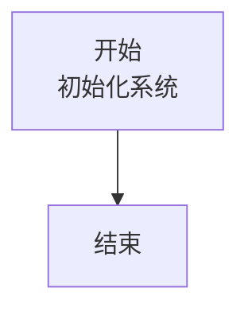
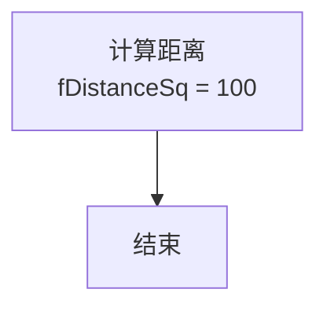
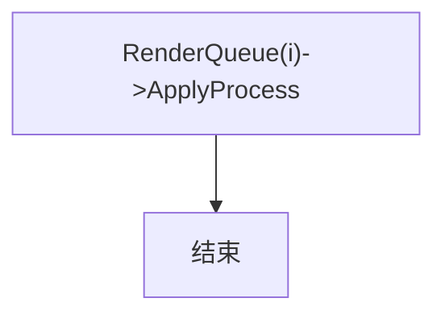
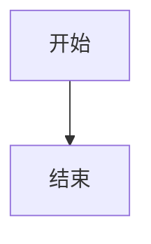

# 使用示例

## 基本检测

扫描目录下所有 markdown 文件中的 mermaid 块，报告问题但不修改：

```bash
python scripts/fix_mermaid.py "K:/Sword12/Document/3DEngine" --check-only
```

输出示例：
```
扫描: K:/Sword12/Document/3DEngine (16 文件)

02_渲染管线详解.md:
  L34: R1: <br/>  BeginRender --> B[初始化渲染目标\nGBuffers/Depth/Shadow]
09_阴影系统完整详解.md:
  L189: R11: 引号标签内含裸引号  C --> D["计算主相机视锥体在\nnear[i"]~far[i]之间的8个角点]

========================================
mermaid 块: 42
发现问题: 2
```

## 自动修复

检测 + 自动修复所有可修复的问题：

```bash
python scripts/fix_mermaid.py "K:/Sword12/Document/3DEngine"
```

## 修复 + mmdc 权威验证

需要 Node.js 环境：

```bash
python scripts/fix_mermaid.py "K:/Sword12/Document/3DEngine" --mmdc
```

## 常见修复场景

### 场景1：`<br/>` 导致渲染失败

修复前：


修复后：


### 场景2：跨行节点标签

修复前：


修复后：


### 场景3：引号标签内含裸引号

修复前：
```mermaid
flowchart TD
    A["RenderQueue[i"]->ApplyProcess] --> B[结束]
```

修复后：


### 场景4：关闭符紧贴节点

修复前：
```mermaid
flowchart TD
    A[开始] --> B[结束]```
```

修复后：

