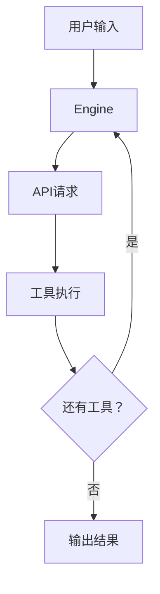
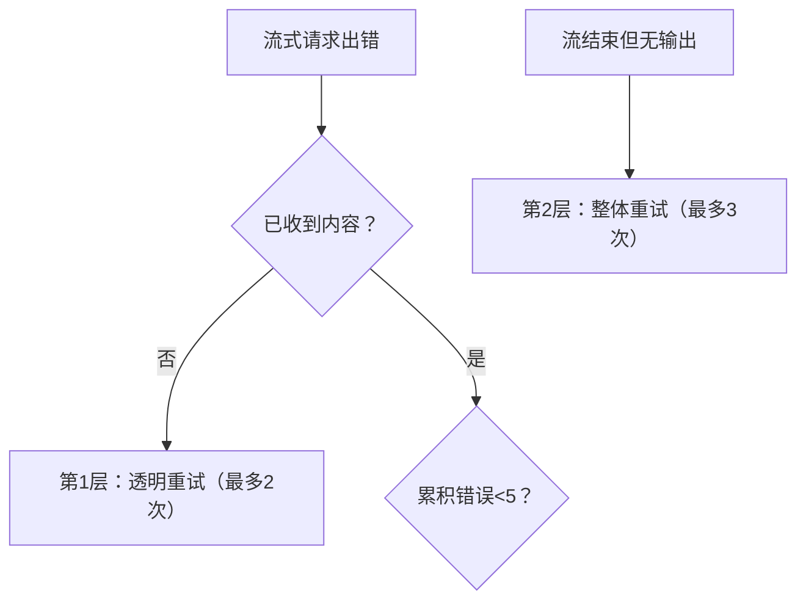
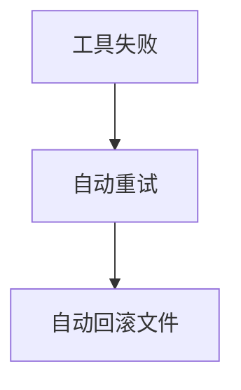
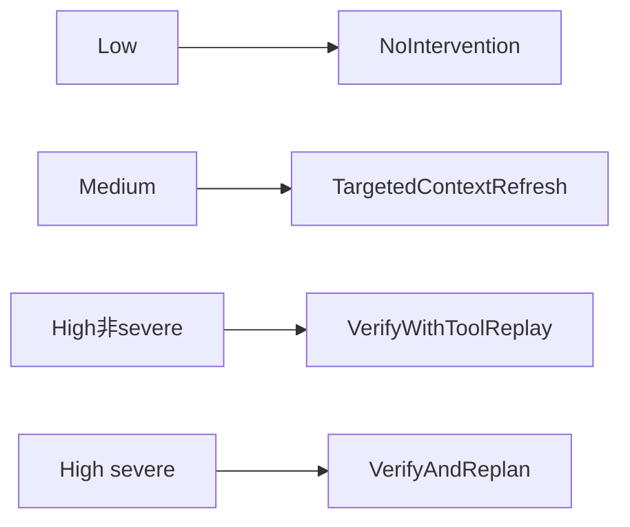

# 示例：架构深潜文档的规则应用

展示 `references/architecture-deep-dive.md` 中每条规则的实际应用案例。所有案例来自 CodeWhale AGENT_LOOP_DEEP_DIVE.md 的写作过程。

参考实际文档：`docs/AGENT_LOOP_DEEP_DIVE.md`

---

## 规则1：总览先行

### Before（无总览，读者直接看细节）

```markdown
## 第一章：Turn Loop 详解

`handle_deepseek_turn` 是一个 while 循环，每次迭代处理一轮 LLM 交互...

## 第二章：工具执行

工具通过 `tools/registry.rs` 分发...

## 总结

核心设计决策：(1) 工具结果用 role: "user" (2) 7步级联退出 (3) 子代理独立上下文
```

问题：读者看到第二章还不知道系统长什么样，总结里的设计决策大部分人看不到。

### After（总览先行）

```markdown
## 总览



**3 个核心设计决策：**

1. **工具结果用 `role: "user"` 注入** — OpenAI 协议要求 tool result 必须跟在 assistant 的 tool_use 后面，chat template 只接受 user/assistant 交替。
2. **退出靠 7 步级联** — 不是简单判断"有工具就继续"，而是在 `tool_uses.is_empty()` 后还有 7 步检查。
3. **子代理不共享上下文** — 独立 cancel token + `fork_context=true`。

## 第一章：Turn Loop 详解
...
```

---

## 规则2：章节要点 + 代码目的

### Before（无要点，无代码总结）

```markdown
## 上下文压缩

### 压缩触发机制

```rust
pub fn should_compact(messages, config, workspace, external_pins, external_working_set_paths) -> bool {
    if !config.enabled { return false; }
    let plan = plan_compaction(messages, workspace, KEEP_RECENT_MESSAGES, ...);
    let token_estimate: usize = plan.summarize_indices.iter()
        .map(|&idx| estimate_tokens_for_message(&messages[idx], false)).sum();
    let effective_token_threshold = config.token_threshold.saturating_sub(pinned_tokens);
    token_estimate > effective_token_threshold
}
```
```

问题：读者被迫读完整段代码才能理解"这函数是干什么的"。

### After（要点 + 代码总结）

```markdown
## 第五章补充：上下文压缩

> **本章要点：** 压缩是**有损且不可逆**的。两阶段策略：先本地裁剪，再 LLM 摘要。

### 压缩触发机制

> **核实依据：** `should_compact` 仅看 token 估算值是否超过有效阈值：

```rust
pub fn should_compact(messages, config, ...) -> bool {
    token_estimate > effective_token_threshold
}
```
```

---

## 规则3：先答核心问题

### Before（上来就讲阈值）

```markdown
### 压缩触发机制

`should_compact` 使用纯 token 阈值判断。v0.8.11 移除了消息计数分支——那是 128K 时代的启发式规则...

### 两阶段压缩策略
...
```

问题：读者看了半天还不知道压缩是不是可逆的。

### After（先答3个核心问题）

```markdown
### 读者最关心的 3 个问题

**Q1：压缩是 LLM 自己总结自己吗？**
不完全是。阶段 1 是纯本地裁剪（不需要 LLM），阶段 2 才调用 LLM 生成摘要。

**Q2：具体怎么压缩的？**
两阶段策略：先本地裁剪重复 tool result，再用 LLM 生成摘要。

**Q3：信息会丢失吗？丢失了能恢复吗？**
**是的，有损且不可逆。** 被摘要的消息原文从内存中删除。

### 压缩触发机制
（细节放后面）
```

---

## 规则4：讲概念讲实现

### Before（只讲 what）

```markdown
### Goal Continuation

当目标仍为 Active 时，引擎会注入继续消息，让模型继续工作。
```

问题：读者追问——Active 怎么变 Active 的？怎么变 Complete 的？模型自己判断吗？

### After（what + how + 违反直觉的点）

```markdown
### Goal 状态变更

Goal 的状态**只能通过 `update_goal` 工具调用**来变更。模型在文本中写"目标已完成"不会被识别。

| 变更路径 | 触发方式 | 校验 |
|---------|---------|------|
| Active → Completed | 模型调用 `update_goal(status="completed")` | 必须是合法枚举值 |
| Active → Cancelled | 模型调用 `update_goal(status="cancelled")` | 同上 |
| 文本中写"目标完成" | **无效** | 引擎不解析模型文本中的状态声明 |

这个设计的 why：如果引擎解析模型文本判断 goal 完成，一次口误就会错误终止整个任务流。
```

---

## 规则5：有损/不可逆开门见山

### Before（不可逆藏在10段之后）

```markdown
> **本章要点：** 两阶段策略：先本地裁剪重复工具结果，再用 LLM 生成摘要。

...（10 段之后）
被摘要的消息原文从内存中删除，不可恢复。
```

### After（开头声明 + 对比表）

```markdown
> **本章要点：** 压缩是**有损且不可逆**的——被摘要的消息原文从内存中删除。

| 防护层 | 保护什么 | 不能保护什么 |
|--------|---------|-------------|
| Pin    | 最近对话 | 更早细节     |
| LLM摘要| 语义主线 | 精确数值     |
| 用户锚点| 显式标记 | 未标记信息   |
```

---

## 规则6：违反直觉必须独立核实

### Before（只写结论）

```markdown
引擎不会自动重试 thinking-only 的输出。
```

问题：读者——一个健壮的 agent 对常见故障不处理？这不合理吧？

### After（结论 + 核实过程 + 为什么仍然合理）

```markdown
**这不自动重试，违反直觉吗？** 专门用独立 agent 从不同角度核实。结论：合理，非遗漏。

1. **Goal continuation 在第 5 步先触发。** thinking-only 只在第 6 步且无活跃目标时到达。
2. **Thinking 不被持久化。** 自动重试 = 同样输入 → 同样输出 → 无限循环。
3. **Issue #1727 修复目的是防 UI 挂起，非增加重试。**
```

---

## 规则7：图小字大 + 文字解释

### Before（一张大图20+节点，无文字）

一张 mermaid 流程图包含 20+ 节点，把超时、溢出、stall、chunk 处理、最大时长、最大字节、流结束、有内容无内容、第1层第2层第3层全部塞进一张图，字体小到看不清，旁边没有任何文字解释。

问题：字体小看不懂，没有文字解释每个分支是什么意思。

### After（小图 + 文字逐层解释）

先文字：

```markdown
**第1层：透明流内重试（用户完全无感知）**
当流式请求出错且尚未收到任何内容时，静默重发。最多 2 次。

**第2层：流整体重试（重新发起完整请求）**
模型返回"空"时，整个请求重发。最多 3 次。

**第3层：累积错误上限（放弃重试）**
同一 stream 内累积 5 个可恢复错误，放弃。
```

再放小图总结：



---

## 规则8：What → Why → How

### Before（上来就堆代码）

```markdown
### 错误升级机制

```rust
if step_error_count > 0 {
    consecutive_tool_error_steps += 1;
} else {
    consecutive_tool_error_steps = 0;
}
```
```

问题：读者不知道这些代码在做什么、为什么这么做。

### After（What → Why → How）

```markdown
### 三级自动干预——从轻到重

**级别1：TargetedContextRefresh**
**What：** 触发一次上下文压缩。
**Why：** Medium 风险时压缩一下通常能理清思路。
**How：** 调用压缩流程，刷新系统提示词。

**级别2：VerifyWithToolReplay**
**What：** 重新执行最近只读工具，对比结果。
**Why：** 模型可能基于过时信息做了修改。
**How：** 找到最近只读工具，重新执行，注入验证消息。

**级别3：VerifyAndReplan**
**What：** 清空对话，注入 canonical state。
**Why：** 对话已无法自修复，必须重置。
**How：** 清空 messages，合并 canonical state 到系统提示词。
```

---

## 规则9：流程图用代码证明

### Before（图画了代码里没有的路径）



问题：代码里根本没有自动回滚——回滚是用户手动 `/undo` 触发的。

### After（图与代码一一对应）



配代码证明：

```rust
pub fn decide_policy(snapshot: &CapacitySnapshot) -> GuardrailAction {
    match snapshot.risk_band {
        RiskBand::Low => GuardrailAction::NoIntervention,
        RiskBand::Medium => GuardrailAction::TargetedContextRefresh,
        RiskBand::High if snapshot.severe => GuardrailAction::VerifyAndReplan,
        RiskBand::High => GuardrailAction::VerifyWithToolReplay,
    }
}
```

---

## 规则10：表格优于段落

### Before（段落揉信息）

```markdown
快照有三种时机。第一种是 turn 开始前，标签是 `pre-turn:<seq>`，用于回退整个 turn 的所有修改。第二种是 turn 结束后，标签是 `post-turn:<seq>`，用于对比 turn 前后差异。第三种是文件修改工具执行前，标签是 `tool:<tool_id>`，用于回退单个工具调用的修改。
```

### After（表格一目了然）

```markdown
| 快照时机 | 标签 | 用途 |
|---------|------|------|
| turn 开始前 | `pre-turn:<seq>` | 回退整个 turn 的所有修改 |
| turn 结束后 | `post-turn:<seq>` | 对比 turn 前后差异 |
| 文件修改工具执行前 | `tool:<tool_id>` | 回退单个工具调用的修改 |
```
