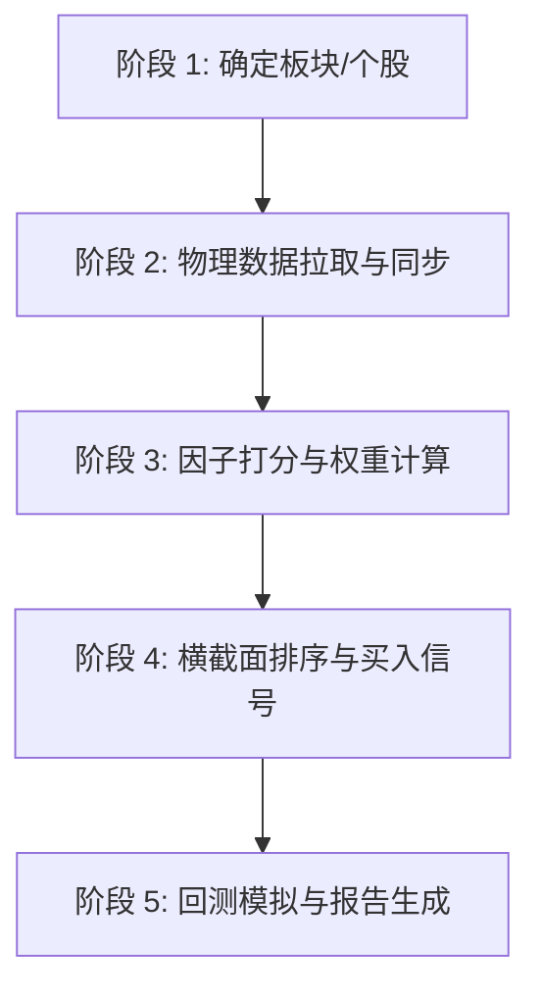

# 多因子策略回测打分流水线 (Multi-Factor Backtest & Scoring Pipeline)

本指南详细描述了在 RetailQuant 中完成多因子选股全流程的核心操作步骤、涉及的文件模块、底层调用接口、执行的指令、因子计算公式以及报告落盘逻辑。

---

## 一、 核心执行流水线 5 大阶段



### 1. 确定板块与个股选择 (阶段 1)
*   **动作**：根据研究主题，确立目标板块（如 `theme:semiconductor`、`theme:compute`）并筛选对应核心股票标的。
*   **设计原则**：每个科技主题优先选择 5 只以上的代表性右侧龙头或成分股，确保横截面排序样本具备统计有效性。

### 2. 双通道物理数据拉取与同步 (阶段 2)
本系统采用“双通道存储”，确保因子在历史长周期与日频实时场景下的超高速读取。
*   **财务基本面同步**：调用东财财务接口下载全 A 股 PE / PB / ROE / 总市值 快照，并持久化到本地基本面数据库。
*   **日 K 线物理拉取**：调用新浪网 K 线接口，一次性下载历史深度（通常限制为 250 天或 5000 天），同时执行三路落盘：
    1.  **Parquet 文件**：以 Snappy 压缩格式覆盖写入 `data/parquet/{code}.parquet` 列存，满足长回测。
    2.  **SQLite klines 表**：批量 `INSERT OR REPLACE` 写入 `cache/rquant.db` 缓存。
    3.  **SQLite pool 表**：自动根据代码前缀打上市场、主标的类别及策略 tags 标签，同步注册到标的池。

### 3. 多因子打分与权重加权 (阶段 3)
*   **动作**：通过策略层加载数据，并对每一只标的在特定历史截面执行“4 道门禁过滤”与“8 大因子计算”。
*   **4 道门禁过滤**：
    1.  **停牌过滤**：当日成交量是否为 0。
    2.  **流动性过滤**：20 日均成交额是否低于 500 万。
    3.  **风险过滤**：股票名称中是否带有 `ST` 或 `退`。
    4.  **历史天数过滤**：有效上市天数/历史日频条数是否低于 60 天。
*   **8 大因子及归一化公式**：
    *   **动量组 (MOMENTUM, W_SUM = 0.35)**：
        *   `M1 20日动量` (W=0.20)：`momentum(df, 20) * 100`。归一化公式：`clip(mom / 10.0, -1.0, 1.0)`。
        *   `M2 60日动量` (W=0.15)：`momentum(df, 60) * 100`。归一化公式：`clip(mom / 20.0, -1.0, 1.0)`。
    *   **趋势组 (TREND, W_SUM = 0.35)**：
        *   `T1 MA20偏离度` (W=0.12)：`(close / MA20 - 1) * 100`。归一化公式：`tanh(bias / 5.0)`。
        *   `T2 均线排列得分` (W=0.10)：`MA5 > MA10 > MA20` 满足给 `+1.0`，空头排列（`MA5 < MA10 < MA20`）给 `-1.0`，其余混乱情况给 `-0.3`。
        *   `T3 60日突破` (W=0.13)：根据现价与 60 日内盘中最高价的相对距离打分。距离 `< 0`（创最高价）给 `1.0`，其余归一化为 `clip(1.0 - dist / 10.0, -1.0, 1.0)`。
    *   **量价组 (VOLUME_PRICE, W_SUM = 0.30)**：
        *   `V1 5日量比` (W=0.12)：`vol_ratio(df, 5)`。归一化公式：`tanh(vr - 1.0, scale=1.0)`。
        *   `V2 量价共振` (W=0.13)：当 `量比 > 1.2 且当日上涨` 或 `量比 < 0.8 且当日下跌` 时，打分公式：`clip((vr - 1.0)/2.0 + chg/5.0, -1.0, 1.0)`，其余不共振给 `0.0`。
        *   `V3 20日波动率惩罚` (W=0.05, 负向项)：取前 20 日（不含当日）的 `标准差 / 均值`。归一化公式：`clip(-(vol - 3.0)/7.0, -1.0, 1.0)`。

### 4. 横截面排序与买入信号触发 (阶段 4)
*   **综合总打分**：
    $$\text{Score} = \sum_{i=1}^8 \text{Factor}_i \times W_i$$
*   **排序机制**：将传入的所有股票的有效 Score 按降序重排，并赋予横截面相对 Rank 与 Rank百分比。
*   **买入信号**：若某只股票的综合打分满足 $\text{Score} \ge \text{SCORE\_BUY} \ (0.50)$，则触发买入信号。

### 5. 调仓回测与报告生成 (阶段 5)
*   **调仓逻辑**：
    1.  **卖出/风控检查**：对当前持仓标的进行先验止盈（如 `TAKE_PROFIT = +15%`）、止损（如 `STOP_LOSS = -8%`）或满期强制强制卖出（如持股满 21 个交易日）过滤。
    2.  **买入/替补开仓**：释放仓位资金后，按照阶段 4 计算得到的最新横截面降序排名，只买入未持仓且排在最前列（TopN）的强势标的。
*   **输出数据**：累计收益率、夏普比率、最大回撤、总交易次数以及每日权益曲线。

---

## 二、 涉及的模块、接口与落盘文件

### 1. 核心代码模块与 API

| 模块名称 | 物理路径 | 核心公开接口 / 类 / 协议 |
|:---|:---|:---|
| **SQLite 存储控制** | `rquant/data_source/db.py` | `get_conn()`: 获取线程安全连接<br>`executemany(sql, seq)`: 批量写入写入 K 线与标的池数据 |
| **Parquet 列存层** | `rquant/data_source/parquet_store.py` | `write(code, df, mode='replace')`: 高速覆盖写入 Snappy 列存<br>`read(code)`: 读取历史 DataFrame |
| **财务元数据快照** | `rquant/data_source/eastmoney.py` | `download_snapshot(snap_date)`: 抓取并写入基本面估值表<br>`get_snapshot(code)`: 获取单股最新的估值与市值快照 |
| **标的池配置层** | `rquant/business/pool_store.py` | `add_to_pool(code, name, sector, kind, tags)`: 注册标的至 SQLite 标的表并同步重载内存缓存 |
| **多因子策略定义** | `rquant/strategy/factor/multi_factor.py` | `MultiFactor` 类:<br>`compute_factors(df)`: 计算 8 个原始归一化因子值<br>`score(df)`: 执行 4 道过滤并计算综合打分<br>`score_batch(code_df_map, name_map)`: 批量获取横截面降序列表 |
| **高层数据包装器** | `rquant/business/data.py` | `fetch_kline(code, days)`: 屏蔽底层源差异，提供一站式 DataFrame 提取接口 |

### 2. 命令行指令 (Command Lines)

*   **数据拉取与多维度落盘指令**：
    ```bash
    # 指令：拉取特定时间跨度内的多只股票日 K，全渠道落盘并在 pool 表中自动归类与标签规范化
    python scripts/fetch_hist.py --from YYYY-MM-DD --to YYYY-MM-DD <code1> <code2> ... <codeN>
    ```
*   **多因子回测指令**：
    ```bash
    # 指令：对 pool 中已启用的多因子标的运行右侧重平衡历史回测
    python scripts/backtest_multi_factor.py --from YYYY-MM-DD --to YYYY-MM-DD
    ```

### 3. 数据落盘文件 (Physical Output Files)

1.  **SQLite 综合业务库**：`cache/rquant.db`
    *   `klines` 表：落盘包含交易日、开高低收、成交量及时间戳的 K 线缓存。
    *   `pool` 表：落盘包含代码、中文名称、板块、主类、JSON 格式标签、启用状态、添加与更新时间戳的元数据。
2.  **SQLite 财务基本面库**：`cache/eastmoney.db`
    *   `financial_snapshot` 表：落盘包含最新滚动市盈率 (PE TTM)、市净率 (PB)、净资产收益率 (ROE)、总市值 (MCAP) 的每日基本面快照。
3.  **Parquet 长周期物理文件**：`data/parquet/{code}.parquet`
    *   严格按照 Arrow 标准 schema（`date`、`open`、`high`、`low`、`close`、`volume`、`amount`、`turnover`）落盘，压缩格式为 Snappy。
