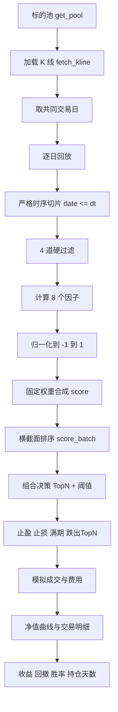
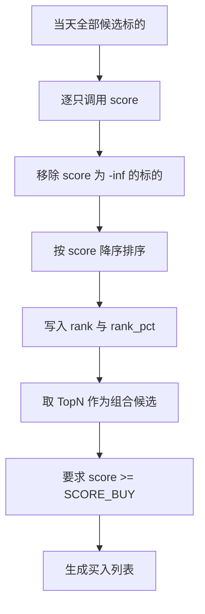
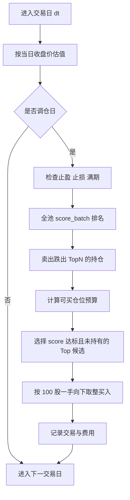

# 多因子选股回测系统（V2 主线）

> 本文档以 `MultiFactor` V2 作为唯一主线，面向策略设计、回测验证和后续调优。
>
> 当前实现对应 `rquant/strategy/factor/multi_factor.py` 与 `scripts/backtest_multi_factor.py`。历史财务因子流水线不再作为主版本维护；如果后续接入 PE/PB/ROE/股息率/市值等财务因子，应直接接入 V2 的 `score()` / `score_batch()` / 回测链路。

---

## 速查结论

| 项目 | 当前 V2 主线 |
|------|--------------|
| 策略定位 | 技术面多因子横截面选股 |
| 因子结构 | 动量 2 个 + 趋势 3 个 + 量价 3 个，共 8 个因子 |
| 过滤结构 | 停牌、流动性、ST/退市、上市/数据天数，共 4 道硬过滤 |
| 核心 API | `compute_factors()`、`score()`、`score_batch()`、`signal_buy()`、`signal_sell()` |
| 组合决策 | 全池打分后按 `score` 降序排序，取 TopN 且满足买入阈值 |
| 默认买入阈值 | `SCORE_BUY = 0.50` |
| 默认风控 | 止盈 +15%，止损 -8%，最大持仓 21 个交易日 |
| 默认回测仓位 | `max_positions = 5`，每只等权，保留 3% 现金缓冲 |
| 推荐调仓基线 | 当前小样本报告显示 `freq=5` 每周调仓优于每日调仓 |
| 当前限制 | 仍缺长历史样本、财务因子、行业约束、真实 T+1 开盘成交、涨跌停不可成交建模 |

---

## 核心思想

多因子策略不是问“这只股票自己看起来是否足够好”，而是问“在同一交易日的候选池里，哪些股票相对更好”。V2 的核心改进是把单只股票时间序列判断和全池横截面排序连接起来：

- 时间序列视角：每只股票只使用自身截至决策日的历史 K 线，计算动量、趋势、量价等因子。
- 横截面视角：同一决策日对所有候选标的打分、排序，优先买入排名靠前且分数达标的标的。
- 组合视角：用 TopN、止盈、止损、持仓期和排名跌出机制，把单只股票信号转成组合调仓动作。

这条主线的设计目标不是追求某一个神奇因子，而是让多个互补信号共同投票：动量确认“已经在走强”，趋势确认“方向是否顺”，量价确认“资金是否配合”，波动率惩罚控制“强势但过度失控”的风险。

---

## 全局流程图



---

## 流程逐项说明

| 流程 | 输入 | 输出 | 作用 | 关键风险 |
|------|------|------|------|----------|
| 标的池读取 | `data.get_pool()` | `{code, name, sector}` 列表 | 定义策略可交易范围，决定横截面排序的比较对象 | 池子太小会导致结论样本偏窄；池子有生存者偏差会高估结果 |
| K 线加载 | 股票代码、天数 | 标准 K 线 DataFrame | 给因子计算提供 `date/open/high/low/close/volume` | 当前回测主要拉 250 日，长期验证不足 |
| 共同交易日 | 所有标的 K 线日期 | `common_dates` | 确保每天估值和调仓使用一致交易日 | 使用共同交集会丢弃缺数据标的的部分日期 |
| 严格时序切片 | 全量 K 线、决策日 `dt` | `df[df["date"] <= dt]` | 防止未来函数，保证当天决策只看当天及以前数据 | 任何传入未来数据的 shortcut 都会污染回测 |
| 硬过滤 | 单只股票历史 K 线、名称 | 通过或 `score = -inf` | 剔除不可交易或风险过高标的 | 过滤阈值过宽会买入低流动性标的，过严会样本不足 |
| 因子计算 | 过滤后的历史 K 线 | 8 个原始因子分数 | 从不同维度刻画强弱、趋势、资金配合和风险 | 因子高度重复会降低信息增量 |
| 归一化 | 原始指标 | `[-1, 1]` 分数 | 把不同量纲的指标变成可相加的分数 | 固定阈值需要跨市场、跨年份验证 |
| 加权合成 | 8 个因子分数 | 单只 `score` | 得到统一排序指标 | 当前权重是先验固定，不是 IC/IR 自适应权重 |
| 横截面排序 | 全池 `{code: df}` | 按 score 降序列表 | 让策略从“单股触发”升级为“组合选股” | 回测与实盘展示要明确是否都使用全池排序 |
| 组合决策 | 排名、阈值、当前持仓 | 买入/卖出候选 | 控制持仓数量、避免满仓追太多噪声信号 | TopN 过小集中风险高，过大稀释 alpha |
| 风控退出 | 持仓成本、收益率、持仓天数、排名 | 卖出动作 | 管住单股亏损、兑现收益、移除失效标的 | 固定止盈止损可能不适配所有波动环境 |
| 交易模拟 | 买卖动作、价格、费率 | 现金、持仓、交易记录 | 把信号转成可衡量的组合净值 | 当前实现主要用当日收盘价近似，真实 T+1 仍需加强 |
| 指标输出 | 净值曲线、交易记录 | 收益、回撤、胜率等 | 衡量策略表现与风险 | 需要加入基准、夏普、Calmar、换手率、IC 等指标 |

---

## 硬过滤设计

硬过滤的作用是先排除“不应该进入排序”的标的。过滤失败时，`score()` 返回 `-inf`，`score_batch()` 会把它从横截面排名里移除。

| 过滤 | 当前规则 | 作用 | 说明 |
|------|----------|------|------|
| 停牌过滤 | 当日 `volume <= 0` | 避免用旧价格买入无法成交的标的 | 成交量为 0 通常意味着无法正常交易 |
| 流动性过滤 | 20 日均成交额 `< 5_000_000` | 排除成交额太小、滑点和操纵风险高的标的 | 当前用 `close * volume` 估算成交额，阈值为 500 万 |
| ST/退市过滤 | 名称含 `ST` 或 `退` | 排除退市风险和异常波动标的 | ETF 名称通常不会触发该规则 |
| 上市/数据天数过滤 | K 线长度 `< 60` | 避免新股或数据不足导致 60 日因子失真 | 60 日动量和 60 日突破都依赖足够历史 |

硬过滤不负责判断“好不好”，只负责判断“能不能进入策略假设”。真正的强弱比较由后续 8 个因子完成。

---

## 因子总览

| 组别 | 权重合计 | 因子 | 单因子权重 | 方向 | 解决的问题 |
|------|----------|------|------------|------|------------|
| 动量组 | 0.35 | M1 20 日动量 | 0.20 | 越高越好 | 捕捉短期强势和主升启动 |
| 动量组 | 0.35 | M2 60 日动量 | 0.15 | 越高越好 | 确认中期趋势，过滤短期反弹噪声 |
| 趋势组 | 0.35 | T1 MA20 偏离 | 0.12 | 适度越高越好 | 判断价格相对 20 日均线的位置 |
| 趋势组 | 0.35 | T2 均线排列 | 0.10 | 多头为正 | 判断短中期趋势结构是否顺畅 |
| 趋势组 | 0.35 | T3 60 日突破 | 0.13 | 越接近新高越好 | 捕捉突破与强势延续 |
| 量价组 | 0.30 | V1 5 日量比 | 0.12 | 放量为正，缩量为负 | 判断资金参与度是否提升 |
| 量价组 | 0.30 | V2 量价共振 | 0.13 | 放量上涨为正，缩量下跌为负 | 判断资金方向是否与价格方向一致 |
| 量价组 | 0.30 | V3 波动率惩罚 | 0.05 | 低波动更优，高波动扣分 | 降低高波动妖股和过度追涨风险 |

权重设计体现了当前 V2 的主观先验：动量和趋势各占 35%，量价占 30%。动量回答“是否已经走强”，趋势回答“结构是否健康”，量价回答“资金是否配合”。

---

## 归一化方式

不同因子的原始单位不同，不能直接相加。V2 把所有因子都转换到 `[-1, 1]` 附近：

| 函数 | 形式 | 适用场景 | 作用 |
|------|------|----------|------|
| `_norm_clip(x)` | `max(-1, min(1, x))` | 动量、突破、量价共振、波动率惩罚 | 有明确上下限时硬截断，避免极端值支配总分 |
| `_norm_tanh(x, scale)` | `tanh(x / scale)` | MA 偏离、量比 | 平滑压缩连续变量，保留强弱顺序但降低极端值影响 |

归一化后的含义：

- `+1`：该因子非常正面。
- `0`：该因子中性或信息不足。
- `-1`：该因子非常负面。

---

## 因子详解

### M1：20 日动量

计算方式：

```text
raw_momentum_20d = close_t / close_{t-20} - 1
momentum_pct = raw_momentum_20d * 100
M1 = clip(momentum_pct / 10)
```

含义：

- 20 个交易日约等于 1 个月，适合捕捉短期主升浪启动。
- 若 20 日涨幅为 +10%，M1 接近 +1；若 20 日跌幅为 -10%，M1 接近 -1。
- 这个因子对近期强势敏感，能快速识别正在被资金推升的标的。

作用：

- 给短期趋势启动加分。
- 与 M2 配合，区分“短期反弹”和“中期趋势延续”。
- 在弱市中容易追到反弹尾部，所以需要 T2/T3 和 V2 辅助确认。

数据要求：

- 至少 21 根 K 线，不足时返回 0。

### M2：60 日动量

计算方式：

```text
raw_momentum_60d = close_t / close_{t-60} - 1
momentum_pct = raw_momentum_60d * 100
M2 = clip(momentum_pct / 20)
```

含义：

- 60 个交易日约等于 1 个季度，反映中期趋势。
- 若 60 日涨幅为 +20%，M2 接近 +1；若 60 日跌幅为 -20%，M2 接近 -1。

作用：

- 确认短期强势是否建立在中期趋势上。
- 降低只看 20 日动量导致的短线噪声。
- 对趋势反转响应慢，所以权重低于 M1。

数据要求：

- 至少 61 根 K 线，不足时返回 0。

### T1：MA20 偏离度

计算方式：

```text
MA20 = mean(close_{t-19} ... close_t)
bias_pct = (close_t / MA20 - 1) * 100
T1 = tanh(bias_pct / 5)
```

含义：

- 衡量当前价格相对 20 日均线的位置。
- 当价格高于 MA20，说明短期趋势偏强；低于 MA20，说明短期趋势偏弱。
- `scale = 5` 表示约 5% 的偏离就会产生较明显分数。

作用：

- 判断价格是否站在短期成本区上方。
- 与 M1 的区别：M1 看从过去到现在的累计涨幅，T1 看当前价格相对近期均价的位置。
- 过高的 MA20 偏离也可能意味着追高风险，因此需要波动率惩罚和止盈机制配合。

数据要求：

- 至少 20 根 K 线，不足时返回 0。

### T2：均线多头排列

计算方式：

```text
MA5  = mean(close_{t-4} ... close_t)
MA10 = mean(close_{t-9} ... close_t)
MA20 = mean(close_{t-19} ... close_t)

if MA5 > MA10 > MA20:
    T2 = +1.0
elif MA5 < MA10 < MA20:
    T2 = -1.0
else:
    T2 = -0.3
```

含义：

- 多头排列表示短期均线高于中期均线，中期均线高于更长一点的均线，趋势结构顺畅。
- 空头排列表示价格结构持续走弱。
- 其他情况属于趋势混乱，给轻微负分。

作用：

- 过滤“涨了一天但结构还没走顺”的噪声。
- 帮助策略偏向趋势更完整的标的。
- 对横盘震荡会偏保守，因为混乱结构默认扣分。

数据要求：

- 至少 20 根 K 线，不足时返回 0。

### T3：60 日突破强度

计算方式：

```text
high_60 = max(high_{t-59} ... high_t)
dist_pct = (high_60 - close_t) / high_60 * 100

if dist_pct < 0:
    T3 = +1.0
else:
    T3 = clip(1.0 - dist_pct / 10.0)
```

含义：

- 价格突破 60 日高点时给满分。
- 距离 60 日高点越近，分数越高。
- 距离高点约 10% 时分数接近 0；距离更远会逐步变成负分，最低为 -1。

作用：

- 捕捉突破行情和强势延续。
- 对“离前高很远”的弱势标的扣分。
- 与 M2 配合，可以识别中期趋势正在接近新阶段的标的。

数据要求：

- 至少 60 根 K 线，不足时返回 0。

### V1：5 日量比

计算方式：

```text
avg_vol_5 = mean(volume_{t-5} ... volume_{t-1})
vol_ratio = volume_t / avg_vol_5
V1 = tanh((vol_ratio - 1.0) / 1.0)
```

含义：

- 当日成交量高于过去 5 日均量，表示资金参与度提升。
- 当日成交量低于过去 5 日均量，表示资金参与度下降。

作用：

- 判断价格变化是否有成交量支持。
- 放量本身不区分方向，所以必须和 V2 共同使用。
- 防止只看价格动量时忽略成交量萎缩导致的假强势。

数据要求：

- 至少 6 根 K 线，不足时返回 0。

### V2：量价共振

计算方式：

```text
vol_ratio = volume_t / mean(volume_{t-5} ... volume_{t-1})
chg_pct = (close_t / close_{t-1} - 1) * 100

if vol_ratio > 1.2 and chg_pct > 0:
    V2 = clip((vol_ratio - 1.0) / 2.0 + chg_pct / 5.0)
elif vol_ratio < 0.8 and chg_pct < 0:
    V2 = clip((vol_ratio - 1.0) / 2.0 + chg_pct / 5.0)
else:
    V2 = 0.0
```

含义：

- 放量上涨：资金和价格方向一致，给正分。
- 缩量下跌：价格下跌且资金参与弱，给负分。
- 量价没有明显方向共振时，保持中性。

作用：

- 给“有资金推动的上涨”加确认。
- 给“弱成交下跌”扣分，避免买入趋势变弱的标的。
- 弥补 V1 只看量、不看价格方向的缺陷。

数据要求：

- 至少 6 根 K 线，不足时返回 0。

### V3：20 日波动率惩罚

计算方式：

```text
close_window = close_{t-20} ... close_{t-1}
vol_pct = std(close_window) / mean(close_window) * 100
V3 = clip(-(vol_pct - 3.0) / 7.0)
```

含义：

- 用最近 20 日价格波动衡量风险。
- 波动率约 3% 时接近中性。
- 波动率越高，分数越低；极高波动会接近 -1。
- 波动率明显低于 3% 时会得到轻微正分，表示走势更稳定。

作用：

- 抑制高波动、高追涨、高回撤风险标的。
- 防止动量和突破因子把组合过度推向妖股。
- 权重只有 0.05，说明它是风险修正项，不是主要收益来源。

数据要求：

- 至少 21 根 K 线，不足时返回 0。
- 当前实现计算波动率时不含当日收盘，避免当日异常波动过度影响惩罚项。

---

## 总分合成

V2 使用固定权重线性合成：

```text
score =
    0.20 * M1_momentum_20d
  + 0.15 * M2_momentum_60d
  + 0.12 * T1_ma20_bias
  + 0.10 * T2_ma_alignment
  + 0.13 * T3_breakout_60d
  + 0.12 * V1_vol_ratio
  + 0.13 * V2_vol_price_sync
  + 0.05 * V3_volatility
```

分数解释：

| score 区间 | 含义 | 策略动作 |
|------------|------|----------|
| `score = -inf` | 未通过硬过滤 | 不参与排序 |
| `< 0` | 综合偏弱 | 不买入 |
| `0 ~ 0.5` | 有一定强度但不足 | 可观察，不作为默认买入 |
| `>= 0.5` | 达到买入阈值 | 进入候选，再看横截面排名和持仓空间 |

`signal_buy()` 的信心度换算：

```text
confidence = min(90, 55 + score * 30)
```

这表示分数越高，信心度越高，但上限封顶 90，避免单一模型输出“绝对确定”的信号。

---

## 横截面选股



横截面排序的意义：

- 单只股票 `score >= 0.5` 只能说明它自己达标。
- 全池 `rank` 才能说明它在当天候选池里相对靠前。
- 组合买入时应优先使用 `score_batch()` 的 TopN 语义，而不是只看单只 `signal_buy()`。

当前边界：

- `score_batch()` 是回测和组合决策的主接口。
- `signal_buy()` 是兼容策略扫描和 Web 展示的单股预警接口。
- 后续如果要让实盘组合与回测完全一致，应增加“全池扫描 + TopN 组合候选”模式，而不是只逐只展示单股信号。

---

## 回测交易流程



交易流程说明：

| 步骤 | 当前规则 | 作用 |
|------|----------|------|
| 每日估值 | 用当日收盘价计算持仓市值 | 形成每日净值曲线，计算回撤 |
| 调仓频率 | `rebalance_freq` 控制，每 N 个交易日调一次 | 控制信号反应速度和换手成本 |
| 先卖后买 | 先处理风险退出和排名跌出，再买入新标的 | 释放现金，避免超过持仓数量 |
| 止盈 | 收益率 `>= +15%` 卖出 | 锁定阶段性利润 |
| 止损 | 收益率 `<= -8%` 卖出 | 限制单股亏损 |
| 满期 | 持仓天数 `>= 21` 卖出 | 防止信号失效后长期占用资金 |
| 排名跌出 | 持仓不在当日 TopN 中卖出 | 让组合持续持有相对更强标的 |
| 买入阈值 | 候选 `score >= 0.50` | 避免 TopN 里低分股票被迫买入 |
| 仓位分配 | `cash * 0.97 / max_positions` | 等权配置并保留现金缓冲 |
| 最小交易单位 | 100 股一手 | 贴近 A 股交易规则 |
| 交易费用 | 买入佣金、卖出佣金 + 印花税 | 防止忽略摩擦成本 |

当前实现说明：

- 脚本注释提到 T+1，但当前主要以当日收盘价近似成交和估值。
- 文档中的优化目标是改成“当日收盘后决策，下一交易日开盘成交”，并加入涨跌停不可成交、停牌、滑点分层等规则。

---

## 风控结构

V2 的风险控制分为 4 层：

| 层级 | 控制点 | 当前规则 | 作用 |
|------|--------|----------|------|
| 交易前过滤 | 标的是否可交易 | 停牌、流动性、ST、数据天数 | 不让高风险或不可交易标的进入排序 |
| 买入过滤 | 是否值得买 | `score >= 0.50` 且横截面靠前 | 降低低分噪声交易 |
| 持仓风控 | 单股收益/亏损/时间 | +15% 止盈、-8% 止损、21 日满期 | 控制单笔交易风险和资金占用 |
| 组合风控 | 相对排名变化 | 跌出 TopN 卖出 | 持续把资金留给更强标的 |

后续优化建议：

- 增加单行业持仓上限，避免 5 只持仓集中在同一行业。
- 增加单票最大权重和最大换手率约束，降低交易噪声。
- 接入 `ScenarioRouter` 的市场状态，在熊市减少个股仓位或切换 ETF/红利低波池。
- 增加波动率目标仓位，让高波动环境自动降低单票仓位。

---

## 回测指标

当前 V2 回测输出：

| 指标 | 含义 | 作用 |
|------|------|------|
| `total_return_pct` | 总收益率 | 判断策略最终赚亏 |
| `annual_return_pct` | 年化收益率 | 方便不同回测长度比较 |
| `max_drawdown_pct` | 最大回撤 | 衡量最坏历史亏损体验 |
| `total_trades` | 总交易笔数 | 观察策略活跃度和换手压力 |
| `win_count` | 盈利卖出笔数 | 统计胜率用 |
| `win_rate_pct` | 按卖出笔数计算的胜率 | 判断信号命中率 |
| `avg_hold_days` | 平均持仓天数 | 判断交易周期是否符合预期 |
| `trades` | 每笔交易明细 | 追踪买卖原因、费用、盈亏 |
| `equity_curve` | 每日净值曲线 | 计算回撤、绘制收益曲线 |
| `skipped` | 被跳过的决策点 | 诊断数据不足或全部被过滤的日期 |

建议补充的指标：

- 夏普比率、Sortino、Calmar、年化波动率。
- 换手率、交易成本占收益比例。
- 基准收益、超额收益、信息比率。
- 单票贡献集中度，避免结果被一两只妖股主导。
- 分行业收益与回撤，判断是否依赖单一赛道。

---

## 推荐调参顺序

调参不要直接从 8 个权重一起网格搜索开始。样本不够时，维度越多越容易过拟合。

建议顺序：

1. 固定当前 8 因子和权重，先复现基线：`freq=1`、`freq=5`、`freq=10`、`freq=15`。
2. 固定 `freq=5` 后扫描 `max_positions`：3、5、7、10。
3. 固定调仓频率和持仓数后扫描 `SCORE_BUY`：0.40、0.50、0.60。
4. 再扫描风控参数：止盈、止损、最大持仓天数。
5. 最后才调整因子权重，优先按因子 IC/ICIR 或分层收益决定，而不是只看单次总收益。

参数选择标准：

- 不只看最高收益，还要看最大回撤、胜率、盈亏比、换手率、成本后收益。
- 参数在多个时间窗口稳定优于基准，才视为可信。
- 对单一年份、单一标的池、单一行业特别有效的参数，不应直接用于实盘。

---

## 测试与验证路线

### 1. 基线复现

固定当前代码、候选池和日期区间，分别复现每日调仓和每周调仓结果。输出文件名应带参数，例如：

```text
backtest_multi_factor_freq1_pos5_buy050_summary.json
backtest_multi_factor_freq5_pos5_buy050_summary.json
```

作用：

- 避免不同参数结果覆盖同一个 `summary.json`。
- 让报告中的结论可以追溯到具体参数和数据。

### 2. 无未来函数测试

构造同一份 K 线数据，把决策日之后的未来价格大幅改动，验证决策日之前的 `score` 和交易结果不变。

作用：

- 防止调参和重构时不小心把未来数据传入因子计算。
- 这是回测可信度的底线测试。

### 3. 因子分层测试

每天把候选池按 `score` 分成 5 组或 10 组，观察高分组是否稳定跑赢低分组。

作用：

- 验证总分是否真的有排序能力。
- 如果高分组不稳定优于低分组，说明当前因子组合可能只是偶然在小样本有效。

### 4. 单因子有效性测试

对每个因子分别计算：

- Rank IC：因子排名与未来收益排名的相关性。
- ICIR：IC 的均值除以标准差，衡量稳定性。
- 分层收益：高因子值组是否跑赢低因子值组。

作用：

- 找出真正有效的因子。
- 识别高度重复或长期无效的因子。
- 为后续动态权重提供依据。

### 5. Walk-forward 调参

用滚动窗口训练和验证参数，例如：

```text
窗口 1：前 6 个月调参，后 3 个月验证
窗口 2：向后滚动 3 个月，再用 6 个月调参，后 3 个月验证
窗口 3：继续滚动
```

作用：

- 把“在历史上调出来的最优参数”放到样本外验证。
- 降低单窗口过拟合风险。
- 观察参数是否稳定，而不是每个窗口都跳到完全不同的组合。

### 6. 压力测试

至少测试以下场景：

| 压力场景 | 目的 |
|----------|------|
| 交易成本翻倍 | 判断收益是否被成本吃掉 |
| 滑点按成交额放大 | 检查低流动性标的的真实可交易性 |
| 熊市窗口单独测试 | 判断回撤和止损是否可接受 |
| 牛市窗口单独测试 | 判断策略是否能跟上趋势 |
| 行业集中窗口测试 | 判断是否过度依赖单一赛道 |
| 去掉单只最大贡献股票 | 判断收益是否依赖妖股 |

---

## 优化路线

### P0：先让评估可信

- 固化 V2 为唯一主线文档和回测入口。
- 统一 `freq=1` 与 `freq=5` 等参数实验的输出命名。
- 增加无未来函数测试、核心因子测试、交易费用测试、最大回撤测试。
- 明确 Web 单股预警与组合 TopN 决策的边界。

### P1：增强因子质量

- 在 V2 框架中直接接入财务因子：PE/PB/ROE/股息率/市值。
- 引入横截面 MAD 去极值和 Z-Score 标准化，减少固定阈值对不同市场阶段的依赖。
- 增加行业中性化或行业内排名，降低同一赛道扎堆。
- 输出每日因子暴露，方便解释每只股票为什么入选。

### P2：增强回测真实性

- 改成真正的 T+1：当日收盘后决策，下一交易日开盘成交。
- 增加涨跌停不可成交处理。
- 增加停复牌处理。
- 增加复权、分红再投资、配股等长期回测事件处理。
- 滑点按成交额、成交量、波动率动态调整。

### P3：形成调参平台

- 独立参数扫描脚本，批量输出 CSV/JSON。
- 自动生成频率、持仓数、阈值、权重的敏感性报告。
- 加入基准组合，自动计算超额收益和信息比率。
- 加入 walk-forward 报告，输出样本内与样本外对比。

---

## 文件清单

| 文件 | 用途 |
|------|------|
| `rquant/strategy/factor/multi_factor.py` | V2 多因子策略核心：8 因子、4 过滤、打分、单股信号 |
| `scripts/backtest_multi_factor.py` | V2 回测引擎：加载标的池、逐日回放、横截面选股、交易和指标输出 |
| `rquant/business/data.py` | K 线业务入口，回测和策略扫描都通过这里取数据 |
| `rquant/business/pool_store.py` | 标的池和自选股持久化 |
| `rquant/strategy/router/scenario_router.py` | 后续可接入市场状态，做牛熊市策略路由和降仓 |
| `results/backtest_multi_factor_trades.csv` | 回测交易明细 |
| `results/backtest_multi_factor_equity.csv` | 回测净值曲线 |
| `results/backtest_multi_factor_summary.json` | 回测指标摘要 |

---

## 使用方式

运行 V2 回测：

```bash
uv run python scripts/backtest_multi_factor.py \
    --capital 1000000 \
    --positions 5 \
    --freq 5 \
    --start 2025-08-01 \
    --out results/backtest_multi_factor_freq5_pos5
```

只用自选股池：

```bash
uv run python scripts/backtest_multi_factor.py \
    --watchlist-only \
    --capital 1000000 \
    --positions 5 \
    --freq 5 \
    --out results/backtest_multi_factor_watchlist_freq5
```

输出文件：

```text
results/backtest_multi_factor_freq5_pos5_trades.csv
results/backtest_multi_factor_freq5_pos5_equity.csv
results/backtest_multi_factor_freq5_pos5_summary.json
```

---

## 维护原则

1. 多因子主版本只维护 V2 链路。
2. 新增因子必须接入 `MultiFactor.compute_factors()` 和 `score()` 的解释输出。
3. 组合回测必须优先使用 `score_batch()` 横截面排序。
4. 文档中的收益结论必须绑定参数、日期区间、候选池和输出文件。
5. 不在同一份报告里混用不同调仓频率的结果。
6. 任何参数优化都必须有样本外验证或 walk-forward 结果支撑。
