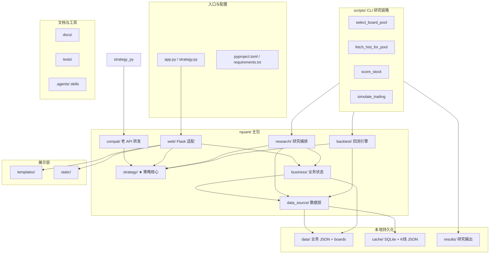

# RetailQuant 大纲（AI 索引用）

> 更新：2026-06-20 | 面向 AI 维护者 | 当前以 `rquant/` 包化架构为准

---

## 项目定位

**RetailQuant 是面向 A 股个人投资者的本地量化系统**——单实例运行、本地优先存储、无需外部券商或云账号。

和普通看盘软件的区别：**策略引擎是项目核心**，Web 看板只负责展示与操作，不承载策略逻辑。

### 解决什么问题

| 痛点 | 本项目做法 |
|------|-----------|
| 只会看行情、缺少系统化买卖依据 | 12 个注册策略输出统一 `Signal`（买入/卖出/信心度/止损止盈） |
| 策略想法难以在历史数据上验证 | CLI 研究链路：板块选池 → 拉数 → **多策略评分** → 组合模拟 → 收益矩阵 |
| 多数据源不稳定 | `DataSourcePool` 健康度路由 + SQLite/Parquet 本地缓存 |
| 持仓与资金分散记录 | `portfolio` + `funds` 双存储，Web 表单统一更新 |

### 双轨能力

```
┌─────────────────────────────────────────────────────────────┐
│  实盘看板轨（日常）          │  研究回测轨（验证）            │
│  python app.py → :8080      │  scripts/*_pool.py 等 + backtest │
│  持仓 / 自选 / 板块 / 信号   │  选池 / 评分 / 模拟 / 矩阵对比  │
│  rquant/web/ + business/    │  rquant/research/ + backtest/ │
└─────────────────────────────────────────────────────────────┘
                              │
                    rquant/strategy/（共享策略核心）
```

- **实盘看板轨**：Flask 单页看板，板块 Treemap、自选股分析、持仓与资金管理。详见 `docs/ui.md`。
- **研究回测轨**：命令行批量跑历史窗口，验证策略在候选池上的可复现表现。整条链路见 `docs/策略回测链路测试文档.md`。
  - **多策略评分阶段**（步骤 2）：对候选池内每只股票、每个 as-of 日，并行运行多个注册策略（含 `MultiFactor`、`MovingAverageCross` 等）产出 score / 买卖信号。
  - `MultiFactor` 是该阶段的策略之一，因子与打分逻辑见 `docs/多因子选股回测系统.md`；`scripts/backtest_multi_factor.py` 仅用于该策略的独立验证，不属于链路里的组合模拟步骤。

### 设计原则

1. **本地优先**：K 线、财务快照、持仓默认落本地 SQLite / Parquet / JSON。
2. **策略与展示分离**：新策略只改 `rquant/strategy/`，Web 层调用 `scan_stock()` 等 API。
3. **防未来函数**：研究链路所有决策使用 `date <= as_of` 的 K 线切片；数据可拉到更晚日期，策略不可偷看未来。
4. **显式联网**：评分/模拟默认不隐式拉数；需要时用 `--fetch-missing` 或单独跑数据准备脚本。

### 相关文档

| 文档 | 用途 |
|------|------|
| `README.md` | 对外简介、启动方式、功能清单 |
| `STRATEGIES.md` | 10 个策略的触发条件与参数 |
| `docs/数据池.md` | 标的池、Parquet、主题池设计 |
| `docs/策略回测链路测试文档.md` | 策略回测链路（选池→拉数→**多策略评分**→模拟）测试条件与命令 |
| `docs/多因子选股回测系统.md` | **多策略评分阶段**中 `MultiFactor` 策略的因子、过滤与打分；含独立验证脚本说明 |
| `docs/代码索引.md` | 概念 → 文件/函数速查 |

---

## 工作目录架构

> 2026-06-20 快照 | 以实际文件树为准；`cache/`、`results/`、`data/parquet/` 等为本地生成，默认不入 Git

### 顶层关系图



### 完整目录树

```
RetailQuant/
├── app.py                          # 薄转发 → rquant.web.app_factory.run()
├── strategy.py                     # 薄转发 → rquant.compat.strategy
├── README.md / STRATEGIES.md       # 对外简介 / 策略详解
├── pyproject.toml / requirements.txt / uv.lock
├── LICENSE / TODOLIST.md
│
├── rquant/                         # ★ 主包（按修改优先级排列）
│   ├── strategy/                   #   策略核心：12 策略 + 注册中心
│   │   ├── base.py / registry.py / __init__.py
│   │   ├── etf_rotation/           #     CrossBorderDca, DividendLowvolRotation
│   │   ├── volume_breakout/        #     VpBreakout
│   │   ├── turtle/                 #     DonchianTurtle
│   │   ├── factor/                 #     MultiFactor, generator, factor_calc
│   │   ├── grid/                   #     GridMartingale
│   │   ├── pattern/                #     DragonTigerPattern
│   │   ├── legacy/                 #     ChanLun2B, BuyHold
│   │   ├── router/                 #     ScenarioRouter, market_regime
│   │   ├── trend/                  #     MovingAverageCross
│   │   └── mean_reversion/         #     RsiMeanReversion
│   ├── business/                   #   业务：持仓/资金/板块/标的池
│   │   ├── data.py / pool_store.py / portfolio.py / funds.py
│   │   ├── board.py / market.py / system.py / user.py
│   ├── data_source/                #   数据：多源路由 + 本地缓存
│   │   ├── pool.py / sina.py / eastmoney.py / db.py
│   │   ├── parquet_store.py / quote_cache.py / cache.py / mq.py
│   ├── research/                   #   研究编排（选池→评分→模拟共享逻辑）
│   │   └── workflow.py
│   ├── backtest/                   #   通用回测引擎
│   │   └── engine.py
│   ├── web/                        #   Flask 入口与路由
│   │   └── app_factory.py / routes.py / views.py
│   └── compat/                     #   老 from strategy import ... 转发
│       └── strategy.py
│
├── scripts/                        # CLI 研究 / 数据准备（调用 rquant/）
│   ├── run.py                      #   替代启动入口
│   ├── select_board_pool.py        #   ① 板块选池
│   ├── fetch_board_universe.py     #   板块 universe .tab 下载
│   ├── fetch_hist.py               #   单股/批量 K 线 → Parquet
│   ├── fetch_hist_for_pool.py      #   ② 候选池拉数
│   ├── score_stock.py              #   ③ 多策略评分
│   ├── simulate_trading.py         #   ④ 组合模拟 + 收益矩阵
│   ├── compare_strategies.py       #   单股多策略对比报告
│   ├── backtest_multi_factor.py    #   MultiFactor 独立验证
│   └── run_backtest.py             #   通用回测 CLI
│
├── templates/                      # Flask 模板
│   ├── index.html                  #   单页看板
│   ├── error.html / test_page.html
├── static/
│   └── style.css                   # 暗色主题
│
├── data/                           # 业务数据（部分 .gitignore）
│   ├── portfolio.json / trades.json / snapshots.json   # 持仓与交易（本地）
│   ├── funds.json / users.json                           # 资金与用户（本地）
│   ├── watchlist.json                                    # 老自选股，仅迁移用
│   ├── boards/                     # 板块 universe（Boards/Stocks/StockBoardRel.tab）
│   └── parquet/                    # 历史日频 Parquet（本地，.gitignore）
│
├── cache/                          # 运行时缓存（本地生成）
│   ├── rquant.db                   # K 线 / 标的池 / meta（.gitignore）
│   ├── eastmoney.db                # 财务快照（.gitignore）
│   └── {code}.json                 # Sina K 线 JSON 缓存
│
├── results/                        # 研究链路输出（本地，不入 Git）
│   ├── v1/                         #   选池 / 评分 / 模拟批次
│   └── strategy_compare_report/    #   compare_strategies 报告
│
├── tests/                          # 测试
│   ├── test_api.py / test_sina.py
│   └── test_phase2_backtest.py
│
├── docs/                           # 设计文档（AI 维护入口）
│   ├── 大纲.md                     #   本文件：架构总纲
│   ├── 代码索引.md / 中英对照表.md
│   ├── 数据池.md / ui.md / strategy设计详解.md
│   ├── 策略回测链路测试文档.md / 多因子选股回测系统.md
│   └── multi_factor_report.md 等
│
├── .agents/skills/                 # Cursor Agent 技能库
├── .cursor/rules/                  # Cursor 行为规则
├── .github/workflows/              # CI（ruff lint）
└── .codewhale/                     # 编码规范说明
```

### 目录职责速查

| 目录 | 职责 | Git |
|------|------|-----|
| `rquant/strategy/` | 策略信号逻辑，项目核心 | 跟踪 |
| `rquant/business/` | 持仓、资金、板块、标的池 | 跟踪 |
| `rquant/data_source/` | 多源 K 线/行情、SQLite/Parquet | 跟踪 |
| `rquant/research/` | 研究链路共享编排（防未来函数切片） | 跟踪 |
| `rquant/backtest/` | 通用回测引擎（权益曲线、交易记录） | 跟踪 |
| `rquant/web/` + `templates/` + `static/` | Flask 看板展示 | 跟踪 |
| `scripts/` | CLI 入口，编排 research/backtest | 跟踪 |
| `data/` | 业务 JSON + 板块 tab；Parquet 本地 | 部分忽略 |
| `cache/` | SQLite + Sina JSON 缓存 | 部分忽略 |
| `results/` | 研究/回测输出 CSV/JSON/HTML | 不提交 |
| `docs/` | 设计与索引文档 | 跟踪 |
| `.agents/` | Agent Skills，与业务无关 | 跟踪 |

---

## 架构分层（修改优先级从高到低）

```
╔════════════════════════════════════════════════════╗
║  ★ rquant/strategy/  策略核心层                    ║
║     12 策略 + 注册中心 + scan_stock API              ║
╠════════════════════════════════════════════════════╣
║  rquant/research/ + rquant/backtest/  研究回测层   ║
║     workflow 编排 / engine 权益曲线与交易模拟        ║
╠════════════════════════════════════════════════════╣
║  rquant/business/  业务层                           ║
║     data / board / portfolio / funds / user / system║
╠════════════════════════════════════════════════════╣
║  rquant/data_source/  数据层                         ║
║     Sina / EastMoney / SQLite / Parquet / MQ / cache ║
╠════════════════════════════════════════════════════╣
║  rquant/web/  入口与展示适配                         ║
║     routes / views / app_factory                    ║
╠════════════════════════════════════════════════════╣
║  scripts/  CLI  │  app.py / strategy.py  兼容入口   ║
╚════════════════════════════════════════════════════╝
```

---

## 各层速查

### ★ `rquant/strategy/` — 策略核心

项目和普通看盘软件的主要区别在这里。新增策略时改策略包，不把策略逻辑写进 Web 层。

| 文件 | 干什么 |
|------|--------|
| `rquant/strategy/base.py` | `Signal` 数据结构、`Strategy` 协议、MA/RSI/ATR 等指标工具 |
| `rquant/strategy/registry.py` | `@register` 注册中心，按 name/category 管理策略 |
| `rquant/strategy/__init__.py` | 导入各策略触发注册，提供 `scan_stock()` / `scan_category()` / `scan_sell()` |
| `rquant/strategy/legacy/` | 兼容版 `ChanLun2B` / `BuyHold` |
| `rquant/strategy/factor/` | 多因子策略 `MultiFactor`（8 个 K 线技术因子）；历史财务因子代码在 `factor_calc.py` |
| `rquant/compat/strategy.py` | 老 `from strategy import ...` API 的转发层 |

**Signal 字段：** `code, name, sector, strategy, category, current_price, suggested_buy, stop_loss, take_profit, reason, confidence, market_state, extra`

当前注册策略（12）：`CrossBorderDca`, `DividendLowvolRotation`, `MultiFactor`, `GridMartingale`, `BuyHold`, `ChanLun2B`, `DragonTigerPattern`, `ScenarioRouter`, `DonchianTurtle`, `VpBreakout`, `MovingAverageCross`, `RsiMeanReversion`。

---

### `rquant/business/` — 业务层

| 文件 | 干什么 |
|------|--------|
| `data.py` | K 线 wrapper、内存股票快照、自选股/标的池兼容转发 |
| `pool_store.py` | SQLite 标的池和自选股持久化，替代老 `_DEFAULT_POOL` 文件内配置 |
| `portfolio.py` | 持仓、交易、快照 JSON 存储 |
| `funds.py` | 总资金、可用资金、已投入资金、已实现盈亏 |
| `board.py` | 东方财富真实行业/概念/地域板块排行与成分股 |
| `market.py` | 大盘指数数据，供场景路由器使用 |
| `system.py` | 市场状态、策略状态、内存系统日志 |
| `user.py` | 默认本地用户与模拟用户数据目录 |

数据池与标的池设计详见 `docs/数据池.md`。该文档记录当前 `pool` / `watchlist` / `DataSourcePool` / Parquet 的结构审查，以及面向多因子策略的主题池、参考池、基准池优化方案。

---

### `rquant/research/` + `rquant/backtest/` — 研究回测层

| 文件 | 干什么 |
|------|--------|
| `rquant/research/workflow.py` | 板块选池、as-of K 线切片、多策略评分、组合模拟的共享编排 |
| `rquant/backtest/engine.py` | 通用回测：按日推进、下单、权益曲线、汇总指标 |
| `scripts/select_board_pool.py` 等 | CLI 薄封装，调用 workflow / engine |

研究链路四步：`select_board_pool` → `fetch_hist_for_pool` → `score_stock` → `simulate_trading`。详见 `docs/策略回测链路测试文档.md`。

---

### `rquant/data_source/` — 数据层

| 文件 | 干什么 |
|------|--------|
| `pool.py` | `DataSourcePool`、K 线源/行情源协议、全局 `pool` |
| `sina.py` | Sina K 线 + SQLite 缓存、Sina 实时行情 + 30 秒 quote cache |
| `eastmoney.py` | akshare 拉取东财财务快照，写入 `cache/eastmoney.db` |
| `db.py` | `cache/rquant.db`，存 K 线、标的池、meta KV |
| `parquet_store.py` | `data/parquet/{code}.parquet` 历史日频列存 |
| `mq.py` | 简易内存消息队列，Flask 启动时后台 worker |
| `quote_cache.py` | 行情 TTL 缓存与击穿保护 |

---

### `rquant/web/` 与前端

| 文件 | 干什么 | 改它的时候 |
|------|--------|-----------|
| `rquant/web/app_factory.py` | `create_app()` / `run()`，启动 MQ 和 Flask app | 启动方式或 Flask 配置变更 |
| `rquant/web/routes.py` | 首页、持仓、资金、板块、自选股、系统状态 API | 新增 API 或表单行为变更 |
| `rquant/web/views.py` | `_compute_treemap()`、watchlist view、表单安全转换、分类标签 | 视图拼装或 Treemap 计算变更 |
| `templates/index.html` | 单页看板 HTML + JS | UI 交互变更 |
| `static/style.css` | 暗色主题样式 | 样式变更 |
| `app.py` | 根目录兼容启动入口 | 通常不改 |

**Web 层不拥有策略逻辑。** 路由做参数解析、调用 business/strategy、渲染模板或 JSON。

---

## 关键常量（分散在各文件）

| 常量 | 值 | 在哪 |
|------|----|------|
| 默认端口 | 8080（`RQUANT_PORT` 覆盖） | `rquant/web/app_factory.py: DEFAULT_PORT` |
| 行情批次缓存 | 30 秒 | `rquant/data_source/quote_cache.py` |
| 源失败冷却 | 60 秒 | `rquant/data_source/cache.py: UNHEALTHY_COOLDOWN` |
| 板块缓存 | 120 秒 | `rquant/business/board.py: CACHE_TTL` |
| 板块 stale 兜底 | 600 秒 | `rquant/business/board.py: STALE_TTL` |
| 默认初始资金 | 1,000,000 | `rquant/business/funds.py: DEFAULT_INITIAL_FUNDS` |
| MultiFactor 买入阈值 | 0.50 | `rquant/strategy/factor/multi_factor.py: SCORE_BUY` |
| MultiFactor 止盈/止损 | +15% / -8% | `rquant/strategy/factor/multi_factor.py` |
| 财务因子 TopN（legacy） | 30 | `rquant/strategy/factor/factor_calc.py: DEFAULT_TOP_N` |

---

## 数据文件

| 路径 | 内容 |
|------|------|
| `cache/rquant.db` | SQLite：K 线、标的池、meta/watchlist |
| `cache/eastmoney.db` | SQLite：财务快照 |
| `cache/{code}.json` | Sina K 线 JSON 缓存 |
| `data/parquet/{code}.parquet` | 历史日频 Parquet |
| `data/boards/*.tab` | 板块 universe（Boards / Stocks / StockBoardRel） |
| `data/portfolio.json` | 持仓 |
| `data/trades.json` | 交易记录 |
| `data/snapshots.json` | 日快照 |
| `data/funds.json` | 默认用户资金快照 |
| `data/users.json` | 用户列表 |
| `data/watchlist.json` | 旧自选股文件，仅首次迁移兼容 |
| `results/v1/` | 研究链路批次输出（选池、评分、模拟矩阵） |
| `results/strategy_compare_report/` | `compare_strategies.py` 对比报告 |

---

## 股票代码格式

小写 `sh`/`sz` + 6 位数字。例：`sh600519`、`sz000001`。

K 线 DataFrame 列名：`date, open, high, low, close, volume`（全小写）。Parquet 额外可有 `amount, turnover`。

---

## 修改速查：想做什么 → 找哪个文件

| 想做什么 | 文件 | 备注 |
|----------|------|------|
| 加/改买入策略 | `rquant/strategy/<category>/` | 新策略类 `@register`，实现 `signal_buy/signal_sell` |
| 查策略注册 | `rquant/strategy/__init__.py` / `registry.py` | 导入子模块触发注册 |
| 改止损止盈参数 | 对应策略类 | 不同策略各自维护参数 |
| 改资金逻辑 | `rquant/business/funds.py` + `rquant/web/routes.py` | 买卖表单需同步资金 |
| 改持仓数据结构 | `rquant/business/portfolio.py` | JSON 读写集中在这里 |
| 改标的池/自选股 | `rquant/business/pool_store.py` | SQLite + meta |
| 加新数据源 | `rquant/data_source/` | 实现 Protocol → `pool.add_*()` |
| 改板块行情 | `rquant/business/board.py` | 当前使用东方财富 push2 |
| 查 UI 交互 / 状态机 | `docs/ui.md` | UI 元素清单、状态机、JS/CSS 速查 |
| 加新 Web 路由 | `rquant/web/routes.py` | 同步 `docs/ui.md` / `docs/代码索引.md` |
| 改前端页面 | `templates/index.html` / `static/style.css` | 前端只渲染和调用 API |
| 跑研究链路 | `scripts/select_board_pool.py` → … → `simulate_trading.py` | 共享逻辑在 `rquant/research/workflow.py` |
| 跑通用回测 | `scripts/run_backtest.py` / `rquant/backtest/engine.py` | 单策略历史验证 |
| 板块 universe | `data/boards/*.tab` + `scripts/fetch_board_universe.py` | 选池前置数据 |

---

## 陷阱

1. **根目录 `app.py` / `strategy.py` 是兼容入口**，新代码优先改 `rquant/`。
2. **Sina / 东方财富接口都会挂**，下游要容错空返回或 stale 缓存。
3. **板块不再是 ETF 代理**，当前 `board.py` 直接拉东方财富真实板块和成分股。
4. **自选股已迁移到 SQLite meta**，`data/watchlist.json` 只做老数据迁移。
5. **资金和持仓是两套存储**，买卖路由必须同时更新 `portfolio.py` 和 `funds.py`。
6. **前端 squarify 已删**，Treemap 坐标由 `rquant/web/views.py` 计算。

---

## 启动

```bash
python app.py
RQUANT_PORT=5060 python app.py
ruff check app.py strategy.py rquant scripts tests
python -c "from rquant.data_source import pool; print(pool.status())"
python -c "from rquant.strategy import all_strategies; print(len(all_strategies()))"  # 期望 12
```
