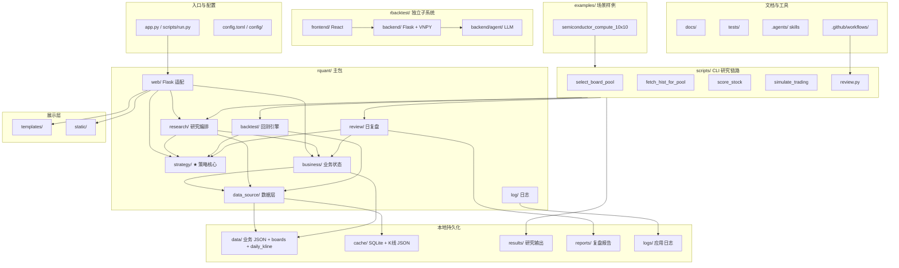

# RetailQuant 大纲（AI 索引用）

> 创建人：   Lyuan741
> 创建时间：  2026-06-17 23:08
> 最后修改人： Lyuan741
> 最后修改时间：2026-06-24 03:19

---

## 项目定位

**RetailQuant 是面向 A 股个人投资者的本地量化系统**——单实例运行、本地优先存储、无需外部券商或云账号。

和普通看盘软件的区别：**策略引擎是 rQuant 主包的核心**，Web 看板只负责展示与操作，不承载策略逻辑。

仓库内另有 **rbacktest 子系统**——基于 VNPY Alpha 的独立 Web 回测应用，与 rQuant **零代码依赖**，策略与数据格式各自隔离。

### 解决什么问题

| 痛点 | 本项目做法 |
|------|-----------|
| 只会看行情、缺少系统化买卖依据 | 12 个注册策略输出统一 `Signal`（买入/卖出/信心度/止损止盈） |
| 策略想法难以在历史数据上验证 | CLI 研究链路：板块选池 → 拉数 → 多策略评分 → 组合模拟 → 收益矩阵 |
| 多数据源不稳定 | `DataSourcePool` 健康度路由 + SQLite/Parquet 本地缓存 |
| 持仓与资金分散记录 | `portfolio` + `funds` 双存储，Web 表单统一更新 |
| 策略横向对比需要专用 UI | rbacktest 独立 React 回测页，7 策略并行对比 + LLM Agent 辅助分析 |
| 收盘后缺少系统化复盘 | `rquant/review/` 自动扫描 → 报告 → 可选邮件 / GitHub Release |

### 多轨能力总览

```
┌──────────────────────────────────────────────────────────────────────────┐
│  rQuant 主系统（共享 rquant/strategy/ 策略核心）                           │
├────────────────────────────┬─────────────────────────────────────────────┤
│  实盘看板轨（日常）         │  研究回测轨（验证）                           │
│  python app.py → :8080    │  scripts/*_pool.py 等 + backtest engine     │
│  持仓 / 自选 / 板块 / 信号  │  选池 / 评分 / 模拟 / 矩阵对比               │
│  rquant/web/ + business/  │  rquant/research/ + backtest/               │
├────────────────────────────┼─────────────────────────────────────────────┤
│  日复盘轨                   │  蒙特卡洛扩展（嵌入看板）                      │
│  scripts/review.py         │  GET /api/montecarlo/<code>                 │
│  + 可选 scheduler / Actions │  rquant/research/montecarlo/                │
└────────────────────────────┴─────────────────────────────────────────────┘

┌──────────────────────────────────────────────────────────────────────────┐
│  rbacktest 子系统（独立，不 import rquant）                                │
│  rbacktest/start.sh → Flask :15000 + React :5173                         │
│  VNPY Alpha 回测 + 7 策略对比 + LLM Agent                                 │
└──────────────────────────────────────────────────────────────────────────┘
```

- **实盘看板轨**：Flask 单页看板，板块 Treemap、自选股分析、持仓与资金管理。
- **研究回测轨**：命令行批量跑历史窗口，验证策略在候选池上的可复现表现。四步链路：`select_board_pool` → `fetch_hist_for_pool` → `score_stock` → `simulate_trading`。
- **日复盘轨**：扫描 enabled 标的池 → 12 策略 → Top-5 信号 → 图表 → Typst/PDF/HTML 报告。
- **蒙特卡洛扩展**：个股路径 stress test，嵌入看板自选股/持仓行。
- **rbacktest 对比轨**：VNPY Alpha 驱动的策略横向排名验证，含 LLM Agent 对话分析。
- **场景样例轨**（`examples/`）：薄编排组合 `scripts/` 层命令；产物与样例同目录存放。

### 设计原则

1. **本地优先**：K 线、财务快照、持仓默认落本地 SQLite / Parquet / JSON。
2. **策略与展示分离**：新策略只改 `rquant/strategy/`，Web 层调用 `scan_stock()` 等 API。
3. **防未来函数**：研究链路所有决策使用 `date <= as_of` 的 K 线切片。
4. **显式联网**：评分/模拟默认不隐式拉数；需要时用 `--fetch-missing` 或单独跑数据准备脚本。
5. **子系统隔离**：rbacktest 与 rQuant 策略注册、Parquet 格式、Web 端口完全独立，不可混用数据目录。

### 外部参考（代码内 README）

| 文件 | 用途 |
|------|------|
| [`README.md`](../README.md) | 对外简介、启动方式 |
| [`rbacktest/README.md`](../rbacktest/README.md) | rbacktest 子系统说明 |
| [`rquant/research/montecarlo/README.md`](../rquant/research/montecarlo/README.md) | 蒙特卡洛 quick reference |
| [`rquant/research/montecarlo/DESIGN.md`](../rquant/research/montecarlo/DESIGN.md) | 蒙特卡洛设计文档 |

### 本仓库 `docs/` 文档地图

完整索引见 [`README.md`](README.md)。分层如下：

| 位置 | 文档 | 用途 |
|------|------|------|
| 根目录 | [`大纲.md`](大纲.md)、[`代码索引.md`](代码索引.md)、[`STRATEGIES.md`](STRATEGIES.md)、[`CHANGELOG.md`](CHANGELOG.md)、[`ui.md`](ui.md)、[`中英对照表.md`](中英对照表.md) | 全局参考，长期维护 |
| [`domain/`](domain/) | [`多因子选股回测系统.md`](domain/多因子选股回测系统.md)、[`multi_factor_report.md`](domain/multi_factor_report.md)、[`数据池.md`](domain/数据池.md) | 多因子与数据池领域专题 |
| [`research/`](research/) | [`策略回测链路测试文档.md`](research/策略回测链路测试文档.md) | 研究回测轨 E2E 测试 |
| [`archive/`](archive/) | `code-walkthrough-2026-06-22.md`、`opt-2026-06-22.md`、`架构分析报告.md`、`TODOLIST.md` | 历史快照，只读参考 |
| [`external/`](external/) | [`qlib_usage.md`](external/qlib_usage.md) | 外部工具（Qlib），非 rQuant 主路径 |

---

## 工作目录架构

> 以实际文件树为准；`cache/`、`results/`、`data/daily_kline/`、`reports/`、`logs/` 等为本地生成，默认不入 Git

### 顶层关系图


```mermaid
flowchart TB
  subgraph entry["入口与配置"]
    app["app.py / scripts/run.py"]
    cfg["config.toml / config/"]
  end

  subgraph core["rquant/ 主包"]
    direction TB
    S["strategy/ ★ 策略核心"]
    B["business/ 业务状态"]
    D["data_source/ 数据层"]
    W["web/ Flask 适配"]
    R["research/ 研究编排"]
    BT["backtest/ 回测引擎"]
    RV["review/ 日复盘"]
    LG["log/ 日志"]
  end

  subgraph rb["rbacktest/ 独立子系统"]
    rbFE["frontend/ React"]
    rbBE["backend/ Flask + VNPY"]
    rbAG["backend/agent/ LLM"]
  end

  subgraph cli["scripts/ CLI 研究链路"]
    sel["select_board_pool"]
    fetch["fetch_hist_for_pool"]
    score["score_stock"]
    sim["simulate_trading"]
    rev["review.py"]
  end

  subgraph examples["examples/ 场景样例"]
    ex10["semiconductor_compute_10x10"]
  end

  subgraph ui["展示层"]
    tpl["templates/"]
    css["static/"]
  end

  subgraph persist["本地持久化"]
    data["data/ 业务 JSON + boards + daily_kline"]
    cache["cache/ SQLite + K线 JSON"]
    res["results/ 研究输出"]
    rpt["reports/ 复盘报告"]
    logs["logs/ 应用日志"]
  end

  subgraph meta["文档与工具"]
    docs["docs/"]
    tests["tests/"]
    agents[".agents/ skills"]
    gha[".github/workflows/"]
  end

  app --> W
  W --> B
  W --> S
  W --> R
  B --> D
  cli --> R
  cli --> BT
  cli --> RV
  R --> S
  R --> B
  R --> D
  BT --> S
  BT --> D
  D --> cache
  D --> data
  cli --> res
  RV --> S
  RV --> B
  RV --> rpt
  LG --> logs
  ex10 --> cli
  W --> tpl
  W --> css
  B --> data
  rbFE --> rbBE
  rbBE --> rbAG
  gha --> rev
```

### 完整目录树

```
RetailQuant/
├── app.py                          # Web 启动入口 → rquant.web.app_factory.run()
├── config.toml                     # rQuant 运行时配置（端口、缓存 TTL、路径等）
├── config/                         # 配置加载（TOML + 环境变量覆盖）
├── README.md                       # 对外简介 / 启动方式
├── pyproject.toml / requirements.txt / uv.lock
├── LICENSE
│
├── rquant/                         # ★ 主包
│   ├── strategy/                   #   策略核心：12 策略 + 注册中心
│   │   ├── base.py / registry.py / __init__.py
│   │   ├── etf_rotation/           #     CrossBorderDca, DividendLowvolRotation
│   │   ├── volume_breakout/        #     VpBreakout
│   │   ├── turtle/                 #     DonchianTurtle
│   │   ├── factor/                 #     MultiFactor, generator, factor_calc
│   │   ├── grid/                   #     GridMartingale
│   │   ├── pattern/                #     DragonTigerPattern
│   │   ├── legacy/                 #     ChanLun2B, BuyHold
│   │   ├── router/                 #     ScenarioRouter, market_regime
│   │   ├── trend/                  #     MovingAverageCross
│   │   └── mean_reversion/         #     RsiMeanReversion
│   ├── business/                   #   业务：持仓/资金/板块/标的池
│   │   ├── data.py / pool_store.py / portfolio.py / funds.py
│   │   ├── board.py / market.py / system.py / user.py
│   ├── data_source/                #   数据：多源路由 + 本地缓存
│   │   ├── pool.py / sina.py / eastmoney.py / db.py
│   │   ├── parquet_store.py / quote_cache.py / cache.py / mq.py
│   ├── research/                   #   研究编排 + 蒙特卡洛
│   │   ├── workflow.py
│   │   └── montecarlo/             #     GBM 路径预测
│   ├── backtest/                   #   通用回测引擎（A 股 T+1）
│   │   └── engine.py
│   ├── review/                     #   日复盘：analyzer → chart → converter → sender
│   ├── web/                        #   Flask 入口与路由
│   │   └── app_factory.py / routes.py / views.py
│   └── log/                        #   loguru 封装
│
├── rbacktest/                      # ★ 独立回测子系统（VNPY Alpha + React + Agent）
│   ├── backend/                    #   Flask API + backtest_engine + strategy/ + agent/
│   ├── frontend/                   #   React + Vite SPA
│   ├── tools/                      #   Qlib 数据转换、股票名称拉取
│   ├── tests/                      #   子系统 pytest
│   ├── data/                       #   VNPY AlphaLab parquet（本地）
│   ├── rbacktest.toml              #   子系统配置
│   ├── start.sh                    #   一键启动 backend + frontend
│   └── README.md
│
├── scripts/                        # CLI 研究 / 数据准备 / 复盘
│   ├── run.py                      #   可选 Web 启动入口
│   ├── select_board_pool.py        #   ① 板块选池
│   ├── fetch_board_universe.py     #   板块 universe .tab 下载
│   ├── fetch_hist.py               #   单股/批量 K 线 → Parquet
│   ├── fetch_hist_for_pool.py      #   ② 候选池拉数
│   ├── score_stock.py              #   ③ 多策略评分
│   ├── simulate_trading.py         #   ④ 组合模拟 + 收益矩阵
│   ├── compare_strategies.py       #   单股多策略对比报告
│   ├── backtest_multi_factor.py    #   MultiFactor 独立验证
│   ├── run_backtest.py             #   通用回测 CLI
│   ├── review.py                   #   手动触发日复盘
│   ├── sync_docs_meta.py           #   docs 元数据同步
│   └── validate_montecarlo.py      #   蒙特卡洛滚动校准
│
├── examples/                       # 场景样例（薄编排 scripts/，报告与产物同目录）
│   └── semiconductor_compute_10x10/
│       ├── run.py
│       ├── report.md
│       └── results/
│
├── templates/                      # Flask 模板（index.html 单页看板）
├── static/                         # 暗色主题 CSS
│
├── data/                           # 业务数据（部分 .gitignore）
│   ├── portfolio.json / trades.json / snapshots.json
│   ├── funds.json / users.json / watchlist.json
│   ├── boards/                     # 板块 universe（.tab）
│   └── daily_kline/                # 历史日频 Parquet（本地，.gitignore）
│
├── cache/                          # 运行时缓存（本地生成）
│   ├── rquant.db                   # K 线 / 标的池 / meta
│   ├── eastmoney.db                # 财务快照
│   └── {code}.json                 # Sina K 线 JSON 缓存
│
├── logs/                           # 应用日志（rquant.log，.gitignore）
├── reports/                        # 复盘报告输出（本地，.gitignore）
├── results/                        # 研究/回测脚本输出（本地，.gitignore）
│
├── tests/                          # rQuant 主包 pytest
├── docs/                           # 设计文档（本文件为架构总纲；见 docs/README.md）
│   ├── 大纲.md / 代码索引.md / STRATEGIES.md / …
│   ├── domain/                     #   多因子、数据池等领域专题
│   ├── research/                   #   研究链路测试
│   ├── archive/                    #   历史快照
│   └── external/                   #   外部工具（Qlib）
├── .agents/skills/                 # Cursor Agent 技能库
├── .cursor/rules/                  # Cursor 行为规则
├── .github/workflows/              # CI（lint）+ 日复盘（daily-review）
└── .codewhale/                     # 编码规范说明
```

### 目录职责速查

| 目录 | 职责 | Git |
|------|------|-----|
| `rquant/strategy/` | 策略信号逻辑，rQuant 核心 | 跟踪 |
| `rquant/business/` | 持仓、资金、板块、标的池 | 跟踪 |
| `rquant/data_source/` | 多源 K 线/行情、SQLite/Parquet | 跟踪 |
| `rquant/research/` | 研究链路编排 + 蒙特卡洛 | 跟踪 |
| `rquant/backtest/` | 通用回测引擎（权益曲线、交易记录） | 跟踪 |
| `rquant/review/` | 日复盘流水线 | 跟踪 |
| `rquant/web/` + `templates/` + `static/` | Flask 看板展示 | 跟踪 |
| `rquant/log/` | loguru 日志封装 | 跟踪 |
| `config/` | TOML 配置单例加载 | 跟踪 |
| `scripts/` | CLI 入口，编排 research/backtest/review | 跟踪 |
| `rbacktest/` | 独立 VNPY Web 回测 + Agent | 跟踪 |
| `examples/` | 可复现场景样例 | 跟踪（results 子目录可忽略） |
| `data/` | 业务 JSON + 板块 tab + daily_kline | 部分忽略 |
| `cache/` | SQLite + Sina JSON 缓存 | 部分忽略 |
| `logs/` / `reports/` / `results/` | 运行时输出 | 不提交 |
| `docs/` | 设计文档 | 跟踪 |
| `.agents/` | Agent Skills，与业务无关 | 跟踪 |

---

## 架构分层

### rQuant 主包（修改优先级从高到低）

```
╔════════════════════════════════════════════════════╗
║  ★ rquant/strategy/  策略核心层                    ║
║     12 策略 + 注册中心 + scan_stock API              ║
╠════════════════════════════════════════════════════╣
║  rquant/research/ + rquant/backtest/  研究回测层   ║
║     workflow 编排 / engine 权益曲线与交易模拟        ║
╠════════════════════════════════════════════════════╣
║  rquant/business/  业务层                           ║
║     data / board / portfolio / funds / user / system║
╠════════════════════════════════════════════════════╣
║  rquant/data_source/  数据层                         ║
║     Sina / EastMoney / SQLite / Parquet / MQ / cache ║
╠════════════════════════════════════════════════════╣
║  rquant/web/  入口与展示适配                         ║
║     routes / views / app_factory                    ║
╠════════════════════════════════════════════════════╣
║  scripts/  CLI  │  app.py  Web 入口                  ║
╚════════════════════════════════════════════════════╝
```

### 并列子系统

| 子系统 | 分层 | 与 rQuant 关系 |
|--------|------|----------------|
| **review** | analyzer → chart → converter → sender | 依赖 strategy + business，独立输出到 `reports/` |
| **montecarlo** | research 子模块，Web 路由暴露 | 依赖 data_source 拉 K 线，嵌入看板 |
| **rbacktest** | React / Flask API / VNPY Engine / Agent | **零 import**，独立策略注册与数据格式 |

---

## 各层速查

### ★ `rquant/strategy/` — 策略核心

新增策略时改策略包，不把策略逻辑写进 Web 层。注册方式：`@register` 装饰器，子模块导入触发注册。

| 策略 | category |
|------|----------|
| `BuyHold` | legacy |
| `ChanLun2B` | legacy |
| `MovingAverageCross` | trend |
| `RsiMeanReversion` | mean_reversion |
| `GridMartingale` | grid |
| `DonchianTurtle` | turtle |
| `VpBreakout` | volume_breakout |
| `CrossBorderDca` | etf_rotation |
| `DividendLowvolRotation` | etf_rotation |
| `DragonTigerPattern` | pattern |
| `MultiFactor` | factor |
| `ScenarioRouter` | router |

统一入口：`from rquant.strategy import scan_stock, scan_sell, scan_category, get, all_strategies`

---

### `rquant/business/` — 业务层

| 模块 | 职责 |
|------|------|
| `data.py` | K 线 wrapper、内存股票快照、自选股/标的池兼容转发 |
| `pool_store.py` | SQLite 标的池和自选股持久化 |
| `portfolio.py` | 持仓、交易、快照 JSON 存储 |
| `funds.py` | 总资金、可用资金、已投入资金、已实现盈亏 |
| `board.py` | 东方财富板块排行与成分股 |
| `market.py` | 大盘指数数据 |
| `system.py` | 市场状态、策略状态、内存系统日志 |
| `user.py` | 默认本地用户与模拟用户数据目录 |

---

### `rquant/research/` + `rquant/backtest/` — 研究回测层

| 模块 | 职责 |
|------|------|
| `research/workflow.py` | 板块选池、as-of K 线切片、多策略评分、组合模拟 |
| `backtest/engine.py` | 通用回测：按日推进、A 股 T+1、权益曲线 |
| `research/montecarlo/` | GBM 路径预测，CLI + Web API |

研究链路四步：`select_board_pool` → `fetch_hist_for_pool` → `score_stock` → `simulate_trading`

---

### `rquant/review/` — 日复盘层

| 模块 | 职责 |
|------|------|
| `analyzer.py` | 扫描标的池全部策略，Top-5 信号，准确性评估 |
| `chart.py` | Top-5 近 90 交易日 SVG 折线图 |
| `converter.py` | JSON → Typst / HTML / PDF |
| `sender.py` | SMTP 邮件发送（可选） |

触发：`scripts/review.py` 手动；`app_factory` 启动 scheduler（`config.review.enabled=true`）；GitHub Actions `daily-review.yml` 定时 → Release 发布。

---

### `rquant/data_source/` — 数据层

| 模块 | 职责 |
|------|------|
| `pool.py` | `DataSourcePool`、K 线源/行情源协议 |
| `sina.py` | Sina K 线 + SQLite 缓存、实时行情 |
| `eastmoney.py` | akshare 财务快照 → `cache/eastmoney.db` |
| `db.py` | `cache/rquant.db`（klines / pool / meta） |
| `parquet_store.py` | `data/daily_kline/{code}.parquet` |
| `mq.py` | 内存消息队列，Flask 启动时后台 worker |
| `quote_cache.py` | 行情 TTL 缓存与击穿保护 |

---

### `rquant/web/` 与前端

| 模块 | 职责 |
|------|------|
| `app_factory.py` | `create_app()` / `run()`，启动 MQ、复盘 scheduler、Flask |
| `routes.py` | 首页、持仓、资金、板块、自选股、蒙特卡洛等 API |
| `views.py` | Treemap 坐标、watchlist view、表单转换 |
| `templates/index.html` | 单页看板 HTML + JS |
| `static/style.css` | 暗色主题样式 |

**Web 层不拥有策略逻辑。** 路由做参数解析、调用 business/strategy、渲染模板或 JSON。

---

### `config/` + `rquant/log/` — 配置与日志

| 模块 | 职责 |
|------|------|
| `config/config.py` | TOML 单例，`from config import config` |
| `config.toml` | server / paths / cache / review / business 等段 |
| `rquant/log/` | loguru 封装，stderr + `logs/rquant.log` + ring buffer |

环境变量：`RQUANT_PORT` 覆盖 `config.server.port`（默认 8080）。

---

### `rbacktest/` — 独立回测子系统

| 层 | 职责 |
|----|------|
| `frontend/` | React SPA：参数面板、对比表、图表、交易明细、历史、Agent 面板 |
| `backend/app.py` | Flask REST API（默认 :15000） |
| `backend/backtest_engine.py` | VNPY Alpha 回测引擎 |
| `backend/strategy/` | 7 策略，`BaseStrategy.__init_subclass__` 自动注册 |
| `backend/agent/` | LLM ReAct 循环 + DeepSeek 工具调用 + 会话持久化 |
| `tools/` | Qlib → VNPY 数据转换 |

7 策略：`equal_weight`、`grid_martingale`、`vp_breakout`、`donchian_turtle`、`ma_cross`、`rsi_reversion`、`buy_hold`

配置：`rbacktest/rbacktest.toml`；环境变量 `RBACKTEST_PORT`（默认 15000）、`RBACKTEST_FRONTEND_PORT`（默认 5173）。

---

## 数据文件

| 路径 | 内容 |
|------|------|
| `cache/rquant.db` | SQLite：K 线、标的池、meta/watchlist |
| `cache/eastmoney.db` | SQLite：财务快照 |
| `cache/{code}.json` | Sina K 线 JSON 缓存 |
| `data/daily_kline/{code}.parquet` | rQuant 历史日频 Parquet |
| `data/boards/*.tab` | 板块 universe |
| `data/portfolio.json` | 持仓 |
| `data/trades.json` | 交易记录 |
| `data/snapshots.json` | 日快照 |
| `data/funds.json` | 默认用户资金快照 |
| `data/users.json` | 用户列表 |
| `data/watchlist.json` | 旧自选股文件，仅首次迁移兼容 |
| `logs/rquant.log` | 应用日志 |
| `reports/` | 复盘报告（json / typ / html / pdf / png） |
| `results/` | 研究/回测脚本输出 |
| `rbacktest/data/daily/*.parquet` | rbacktest 专用 VNPY 格式（与 rQuant 隔离） |

---

## 股票代码格式

小写 `sh`/`sz` + 6 位数字。例：`sh600519`、`sz000001`。

K 线 DataFrame 列名：`date, open, high, low, close, volume`（全小写）。Parquet 额外可有 `code, amount`。

rbacktest 使用 VNPY 格式代码（如 `000300.SSE`），与 rQuant 不同。

---

## 修改速查

| 想做什么 | 找哪里 |
|----------|--------|
| 查文档入口 | [`docs/README.md`](README.md) |
| 加/改 rQuant 策略 | `rquant/strategy/<category>/` |
| 调用策略扫描 | `from rquant.strategy import scan_stock, scan_sell` |
| 改资金/持仓逻辑 | `rquant/business/funds.py` / `portfolio.py` + `rquant/web/routes.py` |
| 改标的池/自选股 | `rquant/business/pool_store.py` |
| 加新数据源 | `rquant/data_source/` |
| 改板块行情 | `rquant/business/board.py` |
| 加 Web 路由 | `rquant/web/routes.py` |
| 改前端页面 | `templates/index.html` / `static/style.css` |
| 跑研究链路 | `scripts/select_board_pool.py` → … → `simulate_trading.py` |
| 跑通用回测 | `scripts/run_backtest.py` / `rquant/backtest/engine.py` |
| 触发日复盘 | `scripts/review.py` 或 `config.review.enabled=true` |
| 蒙特卡洛预测 | `rquant/research/montecarlo/` + Web 路由 |
| 改运行时配置 | `config.toml` + `config/config.py` |
| rbacktest 策略/回测 | `rbacktest/backend/strategy/` + `backtest_engine.py` |
| rbacktest Agent | `rbacktest/backend/agent/` |
| Qlib 数据转换 | `rbacktest/tools/convert_data.py` |

---

## 子系统关系总结

| 维度 | rQuant 主系统 | rbacktest 子系统 |
|------|--------------|-----------------|
| 回测引擎 | 自研 T+1 `rquant/backtest/engine.py` | VNPY Alpha |
| 策略模型 | `Signal` + `@register`（12 个） | `BaseStrategy` 子类注册（7 个） |
| UI | Flask 模板看板 :8080 | React SPA :5173 |
| 历史数据 | `data/daily_kline/{code}.parquet` | `rbacktest/data/daily/*.parquet` |
| 代码共享 | — | **零 import** |
| 配置 | `config.toml` | `rbacktest/rbacktest.toml` |

---

## 陷阱

1. **策略逻辑只在 `rquant/strategy/`**；根目录 `app.py` 仅启动 Web，不存在根目录 `strategy.py`。
2. **rQuant 与 rbacktest 数据不可混用**——Parquet 路径、代码格式、策略注册机制均不同。
3. **Sina / 东方财富接口都会挂**，下游要容错空返回或 stale 缓存。
4. **自选股已迁移到 SQLite meta**，`data/watchlist.json` 只做老数据迁移。
5. **资金和持仓存储不完全一致**——`funds.py` 支持多用户目录，`portfolio.py` 仍为全局单文件；买卖路由需同时更新两者。
6. **复盘默认关闭**——`config.review.enabled=false`，scheduler 不执行分析。
7. **rbacktest Agent 需 `DEEPSEEK_API_KEY`** 环境变量，见 `rbacktest/rbacktest.toml [agent]`。

---

## 启动

```bash
# rQuant 主系统
python app.py
RQUANT_PORT=5060 python app.py

# rbacktest 子系统
cd rbacktest && ./start.sh

# 验证
ruff check app.py rquant config scripts tests
python -c "from rquant.data_source import pool; print(pool.status())"
python -c "from rquant.strategy import all_strategies; print(len(all_strategies()))"  # 期望 12
python scripts/review.py   # 手动复盘（force=True）
```

GitHub Actions：

- `lint.yml` — push/PR 时 ruff + app import smoke
- `daily-review.yml` — 工作日定时复盘 → GitHub Release
