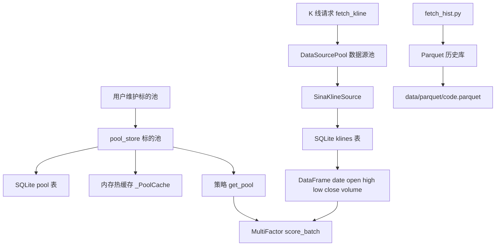
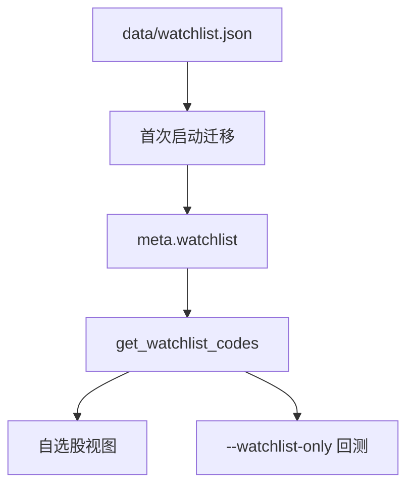
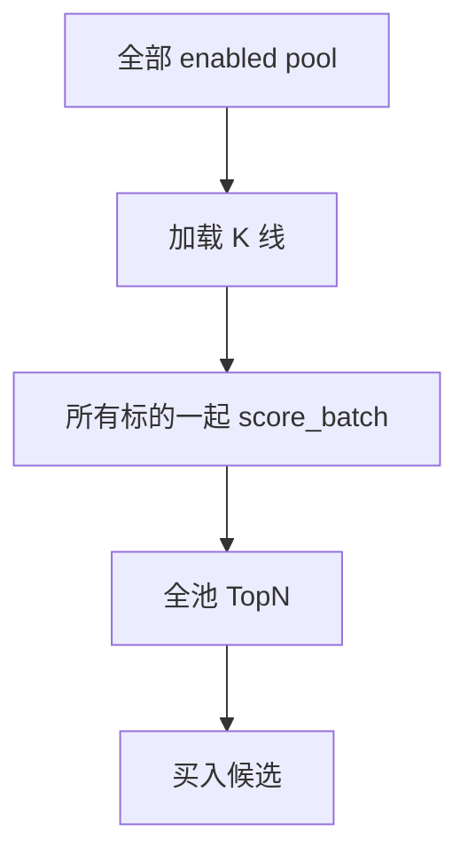
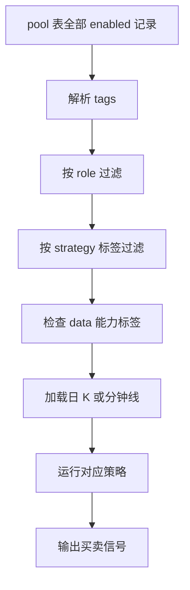
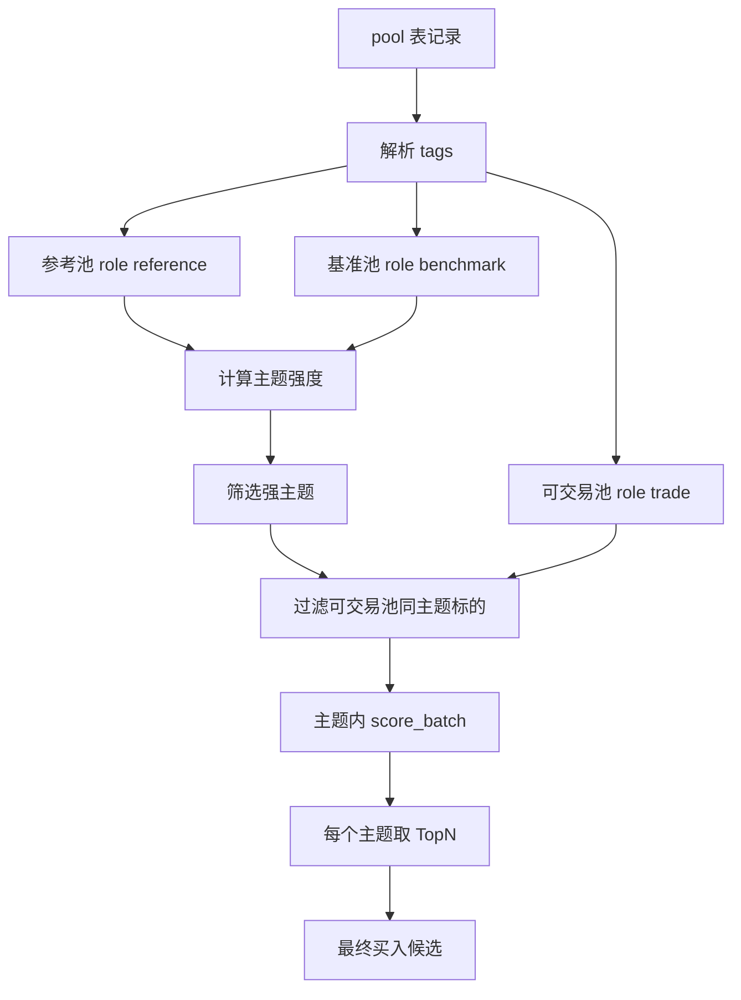

# 数据池设计与优化方案

> 本文档描述 RetailQuant 当前数据池结构、审查结果，以及面向 V2 多因子策略的主题化数据池优化方案。
>
> 这里的“数据池”包含三层含义：标的池、数据源池、历史行情缓存。多因子策略最关心的是“标的池如何定义横截面比较范围”，但它依赖底层 K 线数据源和缓存能力。

---

## 速查结论

| 问题 | 当前状态 | 结论 |
|------|----------|------|
| 当前默认股票池是否适合多因子 | 不适合 | `_DEFAULT_POOL` 只有 5 个早期临时标的，行业过窄，不能代表科技成长方向 |
| 多因子横截面怎么比较 | 对传入的 pool 全部标的一起排序 | 当前不会自动按板块/主题内比较 |
| 是否支持板块类别 | 部分支持 | `sector` 是单值字符串，`tags` 是 JSON 列表，但缺少统一标签规范 |
| 是否区分可买和参考 | 不支持 | 当前只有 `enabled`，没有 `tradable` / `reference_only` / 权限标记 |
| 科创板如何处理 | 需要新增语义 | 科创板可作为参考池，不进入最终买入池 |
| 其它策略是否满足 | 基础日 K 基本满足 | 趋势/突破/低吸类可用；ETF、网格、游资、场景路由还需要额外池语义或数据源 |
| 是否需要一次性拉全 A | 不需要 | 先用 80-150 只主题池做小范围回测更合理 |
| 最优先优化 | 数据池语义 | 先定义主题、市场、角色、可交易权限，再改策略筛选 |

---

## 当前数据池分层



当前有三类“池”：

| 层级 | 代码 | 作用 | 是否参与多因子横截面 |
|------|------|------|----------------------|
| 标的池 | `rquant.business.pool_store` | 管理股票、ETF、指数等候选标的 | 是，`data.get_pool()` 会传给回测 |
| 数据源池 | `rquant.data_source.pool.DataSourcePool` | 管理 K 线源和行情源，负责 failover | 间接参与，给标的池提供行情数据 |
| 历史数据池 | `rquant.data_source.parquet_store` | 存储长历史日频数据 | 当前未接入 V2 回测主链路 |

---

## 当前标的池结构

当前标的池由 `rquant/business/pool_store.py` 管理，持久化在 `cache/rquant.db` 的 `pool` 表中。

### SQLite pool（标的池表）表结构与字段详细解释

| 字段 | 类型 | 当前含义 | 详细解释与实战用途 | 问题与优化 |
|------|------|----------|-------------------|------------|
| `code` | TEXT | 股票/ETF/指数代码，主键 | 唯一标识一个标的（主键，非空）。例如主板个股 `sh600519`（贵州茅台）、`sz000001`（平安银行）、宽基ETF `sh510300`（300ETF）、或大盘指数 `sh000001`（上证指数）。是系统获取 K 线、计算因子和下单的唯一凭证。 | 只有代码本身，原设计中不能表达交易权限，现通过 tags 中的角色标签（如 `role:trade`）做权限区分。 |
| `name` | TEXT | 名称 | 标的的中文简称（如 “士兰微”、“半导体ETF”）。非空。主要用于前端页面展示和回测报告的可读性。 | 可用。 |
| `sector` | TEXT | 单一行业/板块名 | 标的首属的传统申万行业或板块分类名称（如 “半导体”、“消费”、“金融”）。 | 它是单值字符串，无法容纳多属性/多题材股票（比如同时属于半导体、AI和CPO的个股），多因子 V2 中正逐步淘汰此字段，改由 tags 中的 `theme:*`（多主题标签）承载。 |
| `kind` | TEXT | `stock` / `etf` / `index` | 标的的大类属性，限定为股票 `stock`、交易所交易基金 `etf` 或大盘/行业指数 `index`。非空，默认 `stock`。 | 粒度不够，无法区分主板、创业板、科创板。现方案中结合 tags 里的市场标签（如 `market:star` 科创板，`market:chinext` 创业板）来进行精细化区分。 |
| `tags` | TEXT | JSON 字符串列表 | 存储为 JSON 数组格式（如 `["role:trade", "theme:semiconductor", "market:sh_main"]`）。可无限水平扩展，目前用于实现多维度精细化分类标签，是整个标的池灵活性的核心枢纽。 | 有扩展潜力，过去缺少统一标签规范。现已制定了严格的角色、市场、主题、风险、策略、资产和数据能力标签体系。 |
| `enabled` | INTEGER | 是否启用 | 标的启用状态，可选值为 `1`（启用）或 `0`（禁用，忽略该标的）。非空，默认 `1`。策略扫描及行情拉取时将自动过滤掉 `enabled=0` 的标的，用于人工临时剔除异常或停牌个股。 | 只能表示是否全局启用，无法区分标的是作为“可交易”还是“仅参考（科创板等）”。优化方案中通过 tags 中的 `role:trade` 和 `role:reference` 分流。 |
| `added_at` | REAL | 添加时间 | 标的被加入数据库时的 Unix 纪元时间戳（浮点数，如 `1718700000.0`）。非空。用于审计和按时间排序。 | 可用。 |
| `updated_at` | REAL | 更新时间 | 标的最近一次被修改或更新属性时的 Unix 纪元时间戳。非空。用于缓存失效和增量同步判定。 | 可用。 |

### 默认池

当前代码在 `pool` 表为空时注入 5 个默认标的：

| code | name | sector | kind | 审查 |
|------|------|--------|------|------|
| `sh600460` | 士兰微 | 半导体 | stock | 科技方向，可保留 |
| `sh600519` | 贵州茅台 | 消费 | stock | 大消费代表，不适合科技主题池核心 |
| `sh601318` | 中国平安 | 金融 | stock | 金融代表，不适合科技主题池核心 |
| `sz000001` | 平安银行 | 金融 | stock | 金融代表，不适合科技主题池核心 |
| `sh600036` | 招商银行 | 金融 | stock | 金融代表，不适合科技主题池核心 |

审查结论：

- 这 5 个标的是早期临时池，不适合作为当前 V2 多因子横截面池。
- 金融权重过高，和当前关注的半导体、AI、算力、光电、新能源、CPO、机器人方向不匹配。
- 样本太少，TopN 回测容易被单只股票主导。
- 没有区分可买池、参考池、基准池。

---

## 当前自选股结构

自选股由 `meta` 表中的 `watchlist` key 存储，值是 JSON code 列表。

### SQLite meta（元数据 KV 表）表结构与字段详细解释

元信息由 `rquant.data_source.db` 中的 `meta` 表独立维护，主要用于存放自选股列表、系统运行时的键值对配置等全局元数据。

| 字段 | 类型 | 含义 | 详细解释与实战用途 |
|------|------|------|--------------------|
| `key` | TEXT | 元信息键，主键 | 元数据项的唯一字符串标识。例如：保存自选股代码列表的键为 `watchlist`，它是系统的配置检索核心主键。 |
| `value` | TEXT | 元信息值 | 元数据的具体序列化存储内容。对于自选股，它是一个包含股票代码数组的 JSON 字符串（如 `["sh600460", "sh600519"]`）；对于其他轻量级的配置，它可以是任意布尔值（如 `"true"`）、整数、浮点数或常规文本。 |
| `updated_at` | REAL | 更新时间 | 该键值对记录最近一次更新时的 Unix 纪元时间戳。非空。用于同步更新控制以及数据时效性审计。 |



当前特点：

- 自选股不是独立表，而是 `meta.watchlist` 的 code 列表。
- 添加自选股时，会同步加入 `pool`，并附加 `watchlist` tag。
- 删除自选股只从 watchlist 列表移除，不一定从 `pool` 删除。

审查结论：

- 自选股适合用户临时观察，不适合作为正式多因子主题池。
- `watchlist` 可以作为小范围测试入口，但不能替代结构化主题池。
- 未来可以保留 `watchlist` 作为“人工观察池”，不要和策略候选池混在一起。

---

## 当前数据源池结构

`rquant.data_source.pool.DataSourcePool` 管理 K 线源和行情源：

| 源类型 | 当前实现 | 输出 | 用途 |
|--------|----------|------|------|
| K 线源 | `SinaKlineSource` | `{day, open, high, low, close, volume}` | 策略因子和回测 |
| 行情源 | `SinaQuoteSource` | `name, price, change_pct, change_amt` | 前端行情、自选股视图 |

数据源池解决的是“从哪里拉数据”，不是“哪些股票进入策略池”。

当前优点：

- 有 `healthy()` 健康检查。
- 支持多数据源优先级注册。
- Sina K 线有 SQLite 缓存。
- 行情有 30 秒缓存和击穿保护。

当前不足：

- 只有 Sina 一个 K线源和一个行情源。
- K 线源不提供复权、涨跌停、交易状态。
- Sina 日 K 不提供财务因子、行业分类、股息率、总市值。
- 数据源池与 Parquet 历史库尚未在 V2 回测中打通。

### SQLite klines（K 线缓存表）表结构与字段详细解释

K 线数据源从 Sina 等拉取后，会持久化在 `cache/rquant.db` 的 `klines` 表中，用于大幅度提高因子的重复计算效率，并支持离线/低延迟回测与分析。

| 字段 | 类型 | 含义 | 详细解释与实战用途 |
|------|------|------|--------------------|
| `code` | TEXT | 标的代码，联合主键 | 标的代码（如 `sh600519`），对应 `pool` 表中的 `code`。非空。与 `date` 字段组成联合主键（PRIMARY KEY (code, date)）。 |
| `date` | TEXT | 交易日期，联合主键 | 该日 K 线的具体交易日期，采用 `YYYY-MM-DD` 统一文本格式。非空。与 `code` 共同定位唯一的一天 K 线。 |
| `open` | REAL | 开盘价 | 该标的在对应交易日开盘时的首笔交易价格（元）。如果当天整日停牌，此字段可以为 NULL 或保持不变。 |
| `high` | REAL | 最高价 | 该标的在对应交易日交易时段内达到的最高成交价格（元）。 |
| `low` | REAL | 最低价 | 该标的在对应交易日交易时段内达到的最低成交价格（元）。 |
| `close` | REAL | 收盘价 | 该标的在对应交易日的最终收盘价格（元）。作为技术指标、均线、回测盈亏计算、多因子排序的最核心价格基准。 |
| `volume` | INTEGER | 成交量 | 该标的在对应交易日内的累计成交股数（对股票而言为股数，对 ETF 通常为份额）。用于配合价格计算量价突破指标（如 `VpBreakout` 中的量价配合）。 |
| `fetched_at` | REAL | 抓取/更新时间 | K 线数据被本地拉取并写入/同步到该数据库时的 Unix 纪元时间戳。非空。用于判断本地缓存的时间新旧，决定是否需要从服务器强制刷新。 |

### SQLite financial_snapshot（财务数据快照表）表结构与字段详细解释

由 `rquant.data_source.eastmoney` 数据源（基于 akshare）拉取，独立存储在 `cache/eastmoney.db` 的 `financial_snapshot` 表中。主要用于多因子选股中提供基本面（估值与盈利能力）支撑。

| 字段 | 类型 | 含义 | 详细解释与实战用途 |
|------|------|------|--------------------|
| `code` | TEXT | 标的代码，联合主键 | 股票或证券代码（如 `sz000001`）。非空。与 `snap_date` 共同构成联合主键。 |
| `snap_date` | TEXT | 快照日期，联合主键 | 快照生成的特定报告期或发布日期，采用 `YYYY-MM-DD` 格式（如 `2025-12-31`）。非空。代表该财务数据所指的报告时间跨度。 |
| `name` | TEXT | 股票名称 | 标的此时的中文简称（如 “平安银行”）。非空。用于检验和核对标的匹配。 |
| `pe_ttm` | REAL | 滚动市盈率 | 滚动市盈率（PE TTM，Price-to-Earnings Trailing Twelve Months），为当前总市值除以最近12个月的归母净利润。在多因子 V2 中作为主要的估值因子（Value factor），用于筛选估值合理的科技/成长个股。 |
| `pb` | REAL | 市净率 | 市净率（PB，Price-to-Book Ratio），为当前股价除以每股净资产。同样作为估值筛选和风格因子轮动的重要维度。 |
| `roe` | REAL | 净资产收益率 | 净资产收益率（ROE，Return on Equity，以百分比表示），为归母净利润除以净资产。作为盈利质量因子（Quality factor），用于衡量公司资本回报率及基本面景气度。 |
| `mcap` | REAL | 总市值 | 标的对应的总市值。作为规模因子（Size factor）的物理载体，在多因子体系中极为关键，常用于大小盘偏好调节或等权重/市值加权计算。 |
| `fetched_at` | REAL | 抓取/更新时间 | 该条财务快照被下载并存入本地缓存时的 Unix 纪元时间戳。非空。用于过期数据刷新判断。 |

### Parquet 历史长周期列存文件结构与字段详细解释

由 `rquant.data_source.parquet_store` 历史存储层统一管理，数据以单文件形式存放在 `data/parquet/{code}.parquet` 中（如 `data/parquet/sh600519.parquet`），不占用 SQLite 连接，专为高并发、大规模、长周期的多因子回测设计。

| 字段 | Arrow/Pandas类型 | 含义 | 详细解释与实战用途 |
|------|-----------------|------|--------------------|
| `date` | `date32` / `datetime64` | 交易日期，唯一主键 | 标识该行历史日频数据的对应交易日期（主键）。由于 Parquet 为列式存贮，该列极度适合做高速的时间跨度切片过滤。 |
| `open` | `double` / `float64` | 开盘价 | 该标的在该交易日的开盘价格（元）。 |
| `high` | `double` / `float64` | 最高价 | 该标的在该交易日的盘中最高成交价（元）。 |
| `low` | `double` / `float64` | 最低价 | 该标的在该交易日的盘中最低成交价（元）。 |
| `close` | `double` / `float64` | 收盘价 | 该标的在该交易日的收盘价格（元）。 |
| `volume` | `int64` | 成交量 | 该标的在该交易日的累计成交股份数量（股）。 |
| `amount` | `double` / `float64` | 成交额 | 该标的在该交易日发生的累计成交额（元）。对于过滤低成交量标的、判断机构资金异动、计算均额和资金面因子至关重要。 |
| `turnover` | `double` / `float64` | 换手率 | 当日标的的换手率（以百分比形式表示，如 `2.5` 表示换手率为 `2.5%`）。代表市场的活跃程度，是判断个股流动性充裕度、动量及拥挤度（Crowding）的重要指标。 |

---

## 当前多因子横截面范围

当前 V2 回测在 `scripts/backtest_multi_factor.py` 中读取：

```text
pool = data.get_pool()
```

然后把所有可用标的传给：

```text
MultiFactor.score_batch(code_df_map, names)
```

因此当前横截面排序范围是“传入 pool 的所有启用标的”，不是板块内排序。



这会带来两个问题：

- 如果池里混有金融、消费、半导体、ETF、指数，策略会跨风格混排。
- 如果想做“半导体板块内选股”或“CPO 板块内选股”，当前需要调用方先手动筛选 pool。

---

## 其它策略数据需求审查

除 V2 多因子外，当前策略大多使用同一套日频 K 线字段：`date, open, high, low, close, volume`。因此，Sina 日频 K 线可以满足多数基础信号。但不同策略对“标的池语义”的要求不同：有的只能跑 ETF，有的需要指数参考，有的理想状态需要分钟线或事件数据。

| 策略 | 类别 | 当前所需字段/数据 | 当前数据池是否满足 | 主要缺口 |
|------|------|-------------------|--------------------|----------|
| `DonchianTurtle` | 海龟趋势 | 日 K：`high`, `low`, `close`；ATR 需要 `high/low/close` | 满足 | 需要用标签区分适合趋势策略的可交易标的，避免对低流动性/无趋势标的乱扫 |
| `VpBreakout` | 量价突破 | 日 K：`high`, `close`, `volume` | 满足 | 需要涨跌停可成交判断、流动性标签；题材/主题过滤能减少假突破 |
| `CrossBorderDca` | 跨境 ETF 定投 | 日 K：`close`, `volume`；RSI/MA/量比 | 部分满足 | 需要 ETF 池语义、跨境 ETF 标签、T+0/T+1、溢价折价数据 |
| `DividendLowvolRotation` | 红利低波 ETF 轮动 | 日 K：`close`, `volume`；20 日动量、MA20、量比 | 部分满足 | 当前用动量近似，完整版需要股息率、低波动指数/ETF 分类 |
| `GridMartingale` | 网格/马丁 | 日 K：`high`, `low`, `close`；持仓成本和股数 | 基础满足 | 理想需要分钟线；还需要标记适合网格的低趋势、高波动但可控标的 |
| `DragonTigerPattern` | 游资形态 | 日 K：`close`, `high`；涨幅近似涨停、连板近似 | 部分满足 | 需要真实涨停板接口、连板天数、龙虎榜、板块成分股、10cm/20cm/30cm 市场制度 |
| `ChanLun2B` | 缠论二买近似 | 日 K：`open`, `high`, `low`, `close`, `volume`；MA、RSI | 满足 | 需要更好的主题/趋势标的池，降低在弱势股上触发假信号 |
| `BuyHold` | 低吸 | 日 K：`open`, `close`, `volume`；MA60、RSI、20 日跌幅 | 满足 | 需要基本面/退市风险/ST/行业景气过滤，避免低吸问题股 |
| `MarketRegime` | 市场状态 | 指数日 K：默认 `sh000001` 的 `close`，MA20/60/120 | 满足 | 需要把指数作为 `role:benchmark` 或 `market:index`，保证不会进入交易池 |
| `ScenarioRouter` | 场景路由 | 大盘指数状态 + 子策略所需日 K | 部分满足 | 需要策略适用池标签，否则路由启用某类策略后仍会对不适合的标的扫描 |

审查结论：

- **日 K 字段层面**：当前 Sina 日频数据足够支撑趋势、突破、多因子、缠论、低吸、基础 ETF 轮动和基础网格。
- **池语义层面**：当前 `kind` + `sector` 不足以表达“这个标的适合哪个策略、是否可买、是否仅参考、是否 ETF/指数/科创板”。
- **事件数据层面**：游资形态策略缺口最大，需要涨停板、连板、龙虎榜、板块成分股；当前只能用日涨幅近似。
- **频率数据层面**：网格策略当前只能日线近似，若要实盘高频网格，需要分钟线。
- **ETF 细分层面**：跨境 ETF 和红利低波 ETF 需要单独 ETF 池，最好额外标注 `etf:cross_border`、`etf:dividend_lowvol`、`asset:qdii` 等语义。

### 对优化后数据池的满足度

当前文档提出的 `role`、`market`、`theme`、`risk` 标签可以覆盖大部分策略需求，但建议再补充一组“策略适用标签”和“资产类型标签”。

| 新增标签类型 | 示例 | 作用 |
|--------------|------|------|
| 策略适用标签 | `strategy:turtle`, `strategy:breakout`, `strategy:grid`, `strategy:low_absorb`, `strategy:dragon_tiger` | 控制某类策略只扫描适合的标的 |
| ETF 类型标签 | `etf:cross_border`, `etf:dividend_lowvol`, `etf:sector`, `etf:broad_base` | 支持 ETF 轮动策略快速筛选 |
| 交易制度标签 | `limit:10cm`, `limit:20cm`, `limit:30cm`, `trade:t0`, `trade:t1` | 支持涨停、跨境 ETF、创业板/科创板制度差异 |
| 数据能力标签 | `data:daily`, `data:minute_required`, `data:event_required`, `data:premium_required` | 标明当前数据是否足够运行该策略完整版 |

补充这些标签后，优化后的数据池可以满足如下使用方式：

```text
DonchianTurtle      → role:trade + strategy:turtle + data:daily
VpBreakout          → role:trade + strategy:breakout + theme:* + data:daily
CrossBorderDca      → role:trade + kind=etf + etf:cross_border + trade:t0/t1
DividendLowvol      → role:trade + kind=etf + etf:dividend_lowvol
GridMartingale      → role:trade + strategy:grid + data:daily；完整版需 data:minute_required
DragonTigerPattern  → role:trade + strategy:dragon_tiger + limit:*；完整版需 data:event_required
MarketRegime        → role:benchmark + market:index
ScenarioRouter      → 先读 role:benchmark，再按 strategy:* 和 theme:* 路由
```

### 其它策略筛选流程



这个流程和多因子的主题化横截面不冲突。多因子更关心 `theme` 内排序；其它策略更关心“策略是否适合这个标的”。

### 当前运行时扫描缺口

当前 Web 扫描链路仍偏“早期全量探针”模式：读取 `data.get_pool()` 的全部启用标的，对每只标的拉 K 线，再跑所有已注册策略。它不按 `kind`、`role`、`theme`、`strategy:*` 标签过滤。

这会导致：

- 跨境 ETF 策略可能被应用到普通个股上。
- 红利低波 ETF 轮动没有在红利 ETF 子池内做横截面比较。
- 路由器只决定“跑哪些策略类别”，不决定“扫描哪些子池”。
- 游资形态策略没有按主板/创业板/科创板涨跌停制度区分。
- 科创板参考股如果进入 enabled pool，未来可能被普通扫描误当成可买标的。

因此，数据池优化不能只补标签，还需要后续扫描入口消费这些标签。

### 策略大类与推荐子池

| 策略大类 | 推荐子池 | 推荐标签 | 最低 K 线 | 数据池满足度 |
|----------|----------|----------|-----------|--------------|
| `turtle` | 趋势型可交易个股/ETF | `role:trade`, `strategy:turtle`, `data:daily` | 25+ | 日 K 满足，缺策略适用池 |
| `volume_breakout` | 主题强势股 | `role:trade`, `strategy:breakout`, `theme:*`, `data:daily` | 25+ | 日 K 满足，缺涨跌停可成交判断 |
| `factor` | 多因子可交易池或主题池 | `role:trade`, `strategy:factor`, `theme:*` | 60+ | 日 K 满足，缺主题/权限过滤 |
| `etf_rotation` 跨境 | 跨境 ETF 子池 | `role:trade`, `kind=etf`, `etf:cross_border` | 60+ | 基础日 K 满足，缺溢价折价/T+0 元数据 |
| `etf_rotation` 红利 | 红利低波 ETF 子池 | `role:trade`, `kind=etf`, `etf:dividend_lowvol` | 25+ | 基础日 K 满足，完整版缺股息率 |
| `grid` | 震荡型个股/ETF | `role:trade`, `strategy:grid`, `data:daily` | 25+ | 日线骨架满足，完整版缺分钟线 |
| `pattern` | 题材/游资股 | `role:trade`, `strategy:dragon_tiger`, `limit:*` | 10+ | 仅近似满足，缺涨停/龙虎榜事件 |
| `legacy` | 防守/低吸个股池 | `role:trade`, `strategy:low_absorb`, `risk:*` | 65+ | 日 K 满足，缺 ST/退市/基本面过滤 |
| `router` | 基准指数 + 分场景子池 | `role:benchmark`, `market:index`, `strategy:*` | 指数 130+ | 指数日 K 满足，缺分池路由 |

### ETF 静态池接入约定

`rquant/strategy/etf_rotation/universe.py` 里已经有跨境 ETF 和红利低波 ETF 的静态列表，但它们当前没有自动进入 `pool_store`，也不会自动参与 `data.get_pool()` 的运行时扫描。

建议后续二选一：

- 启动或维护脚本把 `CROSS_BORDER_ETFS`、`DIVIDEND_LOWVOL_ETFS` 同步写入 `pool` 表，并附加 `etf:*` 标签。
- 或者废弃代码内静态池，把 ETF 宇宙完全迁移到 `pool` 表，由标签驱动策略筛选。

推荐采用第二种：`pool` 表作为唯一标的池来源，策略不再维护孤立的静态股票/ETF 列表。

### 场景路由器分池约定

`ScenarioRouter` 当前只按市场状态选择策略类别，不选择标的子池。优化后应同时选择策略类别和扫描子池：

| 市场状态 | 策略类别 | 推荐扫描子池 |
|----------|----------|--------------|
| `STRONG_BULL` | `turtle`, `volume_breakout`, `factor` | `role:trade` + 科技成长强主题池 |
| `BULL` | `turtle`, `volume_breakout`, `factor`, `etf_rotation` | 可交易个股池 + 行业/主题 ETF 池 |
| `SIDEWAYS` | `factor`, `grid`, `etf_rotation` | 主题内多因子池 + 震荡网格池 + ETF 池 |
| `BEAR` | `etf_rotation`, `grid`, `legacy` | 防守 ETF 池 + 低吸观察池，降低进攻主题股权重 |
| `STRONG_BEAR` | `etf_rotation`, `legacy` | 红利低波/宽基 ETF + 少量低吸参考池 |

指数如 `sh000001` 应进入 `role:benchmark` + `market:index`，用于市场状态判断，不参与买入扫描。

### K 线深度建议

当前部分扫描入口使用约 70 日 K 线，足够跑多数短周期策略，但对需要 MA60、历史状态或路由器的策略偏紧。

| 用途 | 建议最小天数 | 原因 |
|------|--------------|------|
| 短线形态/突破 | 70 | 覆盖 20 日突破、MA20、低吸基础窗口 |
| 普通策略扫描 | 130 | 覆盖 MA60、MA120 前置需求，减少边界不足 |
| 多因子回测 | 250+ | 覆盖 60 日因子并留足回测窗口 |
| 市场状态 | 130+ | `MarketRegime` 需要 MA120 |
| 长历史参数验证 | 2-3 年起 | 用于 walk-forward、分市场环境验证 |

后续可以统一扫描入口：默认拉 130 日，回测和参数验证走 Parquet 长历史。

---

## 优化目标

数据池优化的目标是把“当前能不能买、属于什么主题、是否仅参考、用于什么策略”表达清楚。

建议拆成三类池：

| 池 | 作用 | 是否进入最终买入 | 例子 |
|----|------|------------------|------|
| 可交易池 | 多因子最终买入候选 | 是 | 沪市主板、深市主板、创业板中账户可买标的 |
| 参考池 | 判断主题强弱和映射方向 | 否 | 科创板半导体、AI 芯片、CPO 龙头 |
| 基准池 | 做基准和板块温度计 | 通常否 | 沪深300ETF、半导体ETF、机器人ETF、科创50 |

科创板处理原则：

- 科创板股票可以进参考池。
- 科创板股票不进入最终交易池。
- 科创板的涨跌、动量、强弱排名可用于判断对应主题是否走强。
- 当科创板某主题走强时，在主板/深市/创业板中寻找对应二级市场可买标的。

---

## 推荐标签体系

当前 `tags` 字段已经能存 JSON 列表，短期可以先用规范化 tag 实现，不一定马上改表结构。

### 角色标签

| 标签 | 含义 |
|------|------|
| `role:trade` | 可进入最终买入候选 |
| `role:reference` | 仅参考，不买入 |
| `role:benchmark` | 基准或指数温度计 |
| `role:watchlist` | 人工观察池 |

### 市场标签

| 标签 | 含义 | 买入权限建议 |
|------|------|--------------|
| `market:sh_main` | 沪市主板 | 可买 |
| `market:sz_main` | 深市主板 | 可买 |
| `market:chinext` | 创业板 | 取决于账户权限 |
| `market:star` | 科创板 | 当前仅参考 |
| `market:etf` | ETF | 可作为交易或基准 |
| `market:index` | 指数 | 仅参考 |

### 主题标签

| 标签 | 中文主题 | 覆盖方向 |
|------|----------|----------|
| `theme:semiconductor` | 半导体 | 芯片设计、设备、材料、封测、功率器件 |
| `theme:ai` | AI | 大模型应用、AI 软件、AI 终端 |
| `theme:compute` | 算力 | 服务器、IDC、液冷、数据中心、交换机 |
| `theme:optoelectronics` | 光电 | 光学、光电器件、激光、显示 |
| `theme:new_energy` | 新能源 | 光伏、储能、锂电、风电、电力设备 |
| `theme:cpo` | CPO/光通信 | 光模块、光芯片、交换机、光通信设备 |
| `theme:robotics` | 机器人 | 减速器、伺服、电机、机器视觉、自动化 |

### 风险标签

| 标签 | 含义 |
|------|------|
| `risk:st` | ST 或退市风险，仅用于记录，不应进入交易池 |
| `risk:low_liquidity` | 低流动性，需降低权重或剔除 |
| `risk:no_trade_permission` | 账户无买入权限 |
| `risk:high_volatility` | 高波动标的，需要更严风控 |

### 策略适用标签

| 标签 | 适用策略 | 含义 |
|------|----------|------|
| `strategy:turtle` | `DonchianTurtle` | 适合趋势突破持有 |
| `strategy:breakout` | `VpBreakout` | 适合量价突破扫描 |
| `strategy:factor` | `MultiFactor` | 适合多因子横截面排序 |
| `strategy:grid` | `GridMartingale` | 适合网格区间交易 |
| `strategy:dragon_tiger` | `DragonTigerPattern` | 适合游资/涨停形态观察 |
| `strategy:low_absorb` | `BuyHold` / `ChanLun2B` | 适合低吸、回调转强类策略 |
| `strategy:router` | `ScenarioRouter` | 可参与场景路由聚合 |

### 资产与交易制度标签

| 标签 | 含义 |
|------|------|
| `etf:cross_border` | 跨境 ETF，需关注 T+0/T+1 和溢价折价 |
| `etf:dividend_lowvol` | 红利低波 ETF |
| `etf:sector` | 行业/主题 ETF |
| `etf:broad_base` | 宽基 ETF |
| `limit:10cm` | 主板 10% 涨跌停制度 |
| `limit:20cm` | 创业板/科创板 20% 涨跌停制度 |
| `limit:30cm` | 北交所 30% 涨跌停制度 |
| `trade:t0` | T+0 交易品种或近似可 T+0 的 ETF |
| `trade:t1` | T+1 交易品种 |

### 数据能力标签

| 标签 | 含义 |
|------|------|
| `data:daily` | 当前日 K 足够运行基础版 |
| `data:minute_required` | 完整版需要分钟线 |
| `data:event_required` | 完整版需要事件数据，如涨停板、龙虎榜、公告 |
| `data:premium_required` | 完整版需要溢价折价或 IOPV 数据 |
| `data:fundamental_required` | 完整版需要财务或股息率数据 |

---

## 推荐池结构

短期不改表结构时，一条记录可以这样表达：

```json
{
  "code": "sh600460",
  "name": "士兰微",
  "sector": "半导体",
  "kind": "stock",
  "tags": [
    "role:trade",
    "market:sh_main",
    "theme:semiconductor",
    "theme:optoelectronics",
    "strategy:factor",
    "strategy:breakout",
    "limit:10cm",
    "trade:t1",
    "data:daily"
  ],
  "enabled": true
}
```

科创板参考股：

```json
{
  "code": "sh688XXX",
  "name": "某科创半导体龙头",
  "sector": "半导体",
  "kind": "stock",
  "tags": [
    "role:reference",
    "market:star",
    "theme:semiconductor",
    "risk:no_trade_permission",
    "limit:20cm",
    "trade:t1",
    "data:daily"
  ],
  "enabled": true
}
```

主题 ETF 基准：

```json
{
  "code": "sh512480",
  "name": "半导体ETF",
  "sector": "半导体",
  "kind": "etf",
  "tags": [
    "role:benchmark",
    "market:etf",
    "theme:semiconductor",
    "etf:sector",
    "strategy:factor",
    "trade:t1",
    "data:daily"
  ],
  "enabled": true
}
```

---

## 主题化横截面方案

多因子策略应支持两种横截面范围：

| 模式 | 横截面范围 | 适用场景 |
|------|------------|----------|
| 全池模式 | 所有 `role:trade` 标的 | 做全市场/全主题选股 |
| 主题模式 | 指定 `theme:*` 内的 `role:trade` 标的 | 做半导体、CPO、机器人等主题内选股 |
| 热点主题模式 | 先找强主题，再在强主题内选股 | 当前用户关注的科技成长方向 |

推荐流程：



这样可以解决两个问题：

- 科创板数据用于判断行业温度，不会误买入无权限标的。
- 多因子排序在同主题内比较，避免金融、消费、半导体、机器人混排导致风格错位。

---

## 主题强度计算建议

主题强度不需要一开始就复杂，可以先用日频 K 线做轻量版本。

| 指标 | 计算方式 | 作用 |
|------|----------|------|
| 主题 20 日动量 | 主题内参考股/ETF 20 日收益均值 | 判断近期是否走强 |
| 主题 60 日动量 | 主题内参考股/ETF 60 日收益均值 | 判断中期趋势 |
| 主题均线结构 | 主题 ETF 或参考池 MA5/10/20 排列 | 判断趋势是否顺 |
| 主题上涨比例 | 主题内上涨标的数量 / 有效标的数量 | 判断是否普涨还是个别股 |
| 主题成交活跃度 | 主题内量比均值 | 判断是否有资金参与 |

初始打分可以是：

```text
theme_score =
    0.35 * theme_momentum_20d
  + 0.25 * theme_momentum_60d
  + 0.20 * theme_breadth
  + 0.20 * theme_volume
```

输出强主题后，再在强主题对应的可交易池里调用 `MultiFactor.score_batch()`。

---

## 数据属性归属：不要都塞进标的池

数据池优化时要先区分“数据属性是否适合落在标的池/行情库”，不要把所有信息都写成 `pool` 表字段或日 K Parquet 列。不同数据的生命周期、更新频率、查询方式完全不同，混在一起会导致表结构膨胀、回测不可复现、实时事件难以清理。

### 三类存储模型

| 模型 | 适合存什么 | 不适合存什么 | 当前/建议位置 |
|------|------------|--------------|---------------|
| AoS（Array of Structs，按标的一行一条记录） | 稳定的标的元数据：`code/name/kind/sector/tags/enabled` | 高频新闻、异动事件、每日因子值 | 当前 `pool` 表 |
| SoA（Struct of Arrays，按字段列式存储） | 规则时间序列：日 K、分钟 K、成交额、复权价、技术因子序列 | 文本新闻、龙虎榜详情、公告原文 | 当前 `data/parquet/{code}.parquet`，后续可扩展特征列 |
| Event / Document Store（事件流/文档） | 热点新闻、异动、公告、龙虎榜、涨停事件、舆情摘要 | 稳定标的属性、规则 OHLCV 序列 | 建议新增事件表或 JSONL/SQLite 专表 |

### 数据归属判断

| 数据 | 是否适合 `pool` 表 | 是否适合 K 线 SoA/Parquet | 推荐存储 |
|------|-------------------|---------------------------|----------|
| 股票代码、名称、市场、是否可买 | 适合 | 不适合 | `pool` 表字段或 tags |
| 主题标签、策略适用标签、风险权限标签 | 适合 | 不适合 | `pool.tags`，后续可拆表 |
| 日 K / 分钟 K | 不适合 | 适合 | SQLite `klines` 或 Parquet |
| 复权价、成交额、换手率 | 不适合 | 适合 | Parquet 扩展列 |
| 每日因子值、主题强度 | 不适合直接放 `pool` | 适合列式或特征表 | `factor_values` / `theme_scores` / Parquet |
| 涨停、炸板、连板、龙虎榜 | 不适合 | 不适合普通 K 线列 | 事件表 `market_events` |
| 热点新闻、政策消息、公告摘要 | 不适合 | 不适合 | 新闻/文档库 `news_events` |
| 异动信息、盘中告警、系统日志 | 不适合 | 不适合 | 事件流或日志表 |
| 用户备注、人工观察原因 | 可少量放 tags，但不宜膨胀 | 不适合 | 注释表 `pool_notes` |

### 设计原则

- `pool` 表只存“标的是什么、能不能买、属于哪些稳定分类、适合哪些策略”。
- K 线和因子序列适合按时间列式存储，便于回测和批量计算。
- 热点新闻、异动、龙虎榜、公告等是事件流，应该用独立事件结构保存，并用 `code`、`theme`、`event_time` 关联到标的池。
- 不要把一次性热点写成永久主题标签。例如“某日 AI 新闻刺激上涨”应是事件，不应直接变成 `theme:ai` 的长期分类依据。
- 事件数据可以影响当日策略评分或风控，但回测时必须带时间戳，确保只使用决策日前已发生的信息。

建议后续新增事件层：

```text
market_events
  event_id        # 事件唯一标识符，主键
  event_time      # 事件/异动/新闻发生的时间戳或具体日期时间
  code            # 主关联标的代码（个股事件时填写，可空）
  theme           # 主关联主题标签（板块事件时填写，可空）
  event_type      # 事件分类类型：limit_up / abnormal_volume / dragon_tiger / policy / news
  impact          # 预期影响方向：bullish / bearish / neutral / mixed
  impact_level    # 预期影响强度分级：1-5 级
  related_themes  # 关联板块或主题列表：JSON 字符串数组，如 ["theme:semiconductor", "theme:cpo"]
  related_codes   # 关联个股代码列表：JSON 字符串数组，如 ["sh600460", "sz300XXX"]
  source          # 信息来源：如 Sina、Eastmoney、NewsAgent、System
  title           # 事件/新闻标题简述
  payload_json    # 详细内容载荷：存储具体非结构化数据的 JSON 字符串
  sentiment_score # 自然语言处理得出的舆情情感分析得分（-1.0 到 1.0）
  created_at      # 记录存入本地系统数据库的时间戳
```

字段详细说明与设计：

| 字段 | 类型 | 说明 | 实战用途与策略逻辑 |
|------|------|------|--------------------|
| `event_id` | TEXT / INTEGER | 事件的唯一标识符（主键）。 | 唯一识别一条事件日志，避免由于重试或多源合并产生重复事件。 |
| `event_time` | TEXT / REAL | 事件、异动、新闻或政策发生的具体时刻，格式为 `YYYY-MM-DD HH:MM:SS` 或 Unix 时间戳。 | **极其关键**！在策略评分与风控时，用于确保回测只使用**决策发生时点之前**已知的事件信息（即决策不偷看未来）。 |
| `code` | TEXT | 主关联的证券标的代码（如 `sh600460`），对应 `pool` 中的 `code`。若非单股事件则为 NULL 或空。 | 当事件为个股特异事件（如个股涨停、发布重组公告、个股被龙虎榜记录等）时，直接关联并驱动该股的分数加减。 |
| `theme` | TEXT | 主关联的主题或板块标签（如 `theme:semiconductor`）。若非特定单一行业政策，则为 NULL 或空。 | 用于定位受政策/新闻直接波及的核心板块，利于提升或压低整个主题的投资强度或评级。 |
| `event_type` | TEXT | 事件的结构化分类类型。可选项如：<br>- `limit_up`：涨停板/连板事件<br>- `abnormal_volume`：盘中/日K级别成交量异常放大<br>- `dragon_tiger`：个股龙虎榜买卖席位异动<br>- `policy`：国家或地方产业重大政策扶持/监管限制<br>- `news`：重大公司公告或主流舆情新闻 | 策略分类分发的基础。如游资形态策略 `DragonTigerPattern` 专门筛选并路由 `dragon_tiger` 与 `limit_up` 事件类型。 |
| `impact` | TEXT | 预期方向。可选项为：<br>- `bullish`：利好 / 看多<br>- `bearish`：利空 / 看空<br>- `neutral`：中性<br>- `mixed`：多空交织 / 无法单一断定 | 直接决定此事件是对所属主题或个股的因子评分做“加分（Bullish）”还是“扣分（Bearish）”处理。 |
| `impact_level` | INTEGER | 事件预期影响烈度级别，建议取值为 `1` 到 `5` 之间的整数。 | 用于区分事件分量轻重：<br>- `1`：日常常规波动公告或小板块新闻<br>- `3`：主流个股业绩大超预期、行业细分龙头变动<br>- `5`：重特大国家产业红利政策、ST停牌或濒临退市。是因子计算中权重的乘数乘子。 |
| `related_themes` | TEXT | 关联的其它板块或主题列表。在数据库中存储为 JSON 字符串数组（如 `["theme:semiconductor", "theme:cpo"]`）。 | 面对具有跨行业特征的复合大事件（如“重磅芯片算力政策扶持”），可同时利好半导体与算力两个独立的主题分类。 |
| `related_codes` | TEXT | 事件联动波及的证券代码列表。在数据库中存储为 JSON 字符串数组（如 `["sh600460", "sz300XXX"]`）。 | 适用于集群联动事件（如某板块发布联合并购公告，或某一子行业大龙头出现重大变故），用以实现个股因子的级联传导。 |
| `source` | TEXT | 信息来源渠道标识（例如 `Sina` / `Eastmoney` / `NewsAgent` / `System` ）。 | 用于评估数据可信度，并在多源合并去重、数据源失效分析时提供判定依据。 |
| `title` | TEXT | 事件或新闻的主题标题、概要描述。 | 用于在回测报告、系统展示、监控大屏中提供简明直观的文字渲染，辅助人工直观理解。 |
| `payload_json` | TEXT | 详细内容载荷，为 JSON 格式的大文本字符串。 | 存储个性化的、不便于做关系型列存的非结构化/半结构化原始数据（如龙虎榜席位资金明细、新闻正文文本或公告原文字段）。 |
| `sentiment_score` | REAL | 舆情情感量化得分，范围在 `[-1.0, 1.0]` 区间。 | 使用 NLP 算法或大模型提取的更精准、细颗粒度的情绪得分（-1.0代表极度悲观利空，1.0代表极度乐观利好，0为纯中性）。 |
| `created_at` | REAL | 记录创建的本地 Unix 时间。非空。 | 系统本地建档归档审计时间，主要用于追溯数据库写入延迟。 |

这样可以让游资形态、热点主题、多因子主题强度使用新闻/异动信息，同时不污染 `pool` 表和日 K 历史库。利好/利空事件进入策略评分时必须带 `event_time`，回测只能使用决策时点之前已经发生的事件。

---

## 小范围测试数据池

不建议一次性拉全 A 20 年。建议先建 80-150 只主题池。

| 主题 | 可交易池规模 | 参考池规模 | 说明 |
|------|--------------|------------|------|
| 半导体 | 20-30 | 5-10 | 主板/深市可买 + 科创龙头参考 |
| AI | 15-25 | 5-10 | AI 应用、软件、终端、传媒 |
| 算力 | 15-25 | 5-10 | 服务器、IDC、液冷、交换机 |
| 光电 | 10-20 | 5-10 | 光电器件、光学、激光、显示 |
| 新能源 | 20-30 | 5-10 | 光伏、储能、锂电、电力设备 |
| CPO/光通信 | 10-20 | 5-10 | 光模块、光芯片、通信设备 |
| 机器人 | 15-25 | 5-10 | 减速器、伺服、电机、机器视觉 |

测试顺序：

1. 每个主题先挑 10 只可交易标的 + 3 只参考标的。
2. 拉 2-3 年日频数据。
3. 先做主题内 TopN 回测。
4. 再做热点主题筛选 + 主题内 TopN。
5. 最后扩展到 80-150 只。

---

## 分阶段优化路线

### P0：文档和语义先行

- 确认数据池分为 `trade`、`reference`、`benchmark` 三类。
- 制定 `tags` 规范：角色、市场、主题、风险。
- 将现有默认池标注为历史临时池，不再作为多因子主池。
- 在回测报告中记录横截面范围：全池、指定主题、热点主题。
- 明确策略大类与推荐子池的映射，避免全池全策略无差别扫描。
- 明确 ETF 静态池与 `pool` 表的关系，避免 `universe.py` 和运行时池脱节。
- 将指数纳入 `role:benchmark` 语义，供 `MarketRegime` 和 `ScenarioRouter` 使用。

### P1：主题池落地

- 用 `tags` 先实现主题分类，不急于改 SQLite 表结构。
- 添加科技成长主题池：半导体、AI、算力、光电、新能源、CPO、机器人。
- 科创板标的统一标记 `role:reference` + `market:star` + `risk:no_trade_permission`。
- 回测入口支持按 `theme` 和 `role` 过滤 pool。

### P2：策略联动

- 增加“主题内横截面”模式。
- 增加“热点主题筛选”模式。
- 支持每个主题取固定数量，如每个强主题 Top2，总持仓不超过 5。
- 输出每只买入候选的主题标签和所属横截面。

### P3：结构升级

当 `tags` 方案验证有效后，再考虑数据库结构升级：

| 新表/字段 | 作用 |
|-----------|------|
| `pool_roles` | 独立存储 trade/reference/benchmark |
| `pool_themes` | 一只股票对应多个主题 |
| `pool_permissions` | 记录账户是否可买、是否仅观察 |
| `theme_scores` | 缓存每日主题强度 |
| `pool_snapshots` | 固化每次回测使用的候选池，保证可复现 |

---

## 审查结论

当前数据池已经具备基础能力：SQLite 持久化、内存缓存、`kind` 分类、`tags` 扩展、Sina K 线和行情数据源。但它仍是“通用标的列表”，还不是“面向多因子策略的主题化候选池”。

最关键的短板不是数据拉取，而是池的语义不够：

- 不知道哪些标的可买。
- 不知道哪些标的仅参考。
- 不知道一只股票属于哪些热门主题。
- 不知道科创板参考数据如何映射到可买标的。
- 不知道多因子横截面应该在全池内比，还是主题内比。

建议优先用 `tags` 做轻量升级：先不改表结构，先把角色、市场、主题、风险标签规范化。等主题池和回测逻辑跑通后，再考虑拆表和迁移。

---

## 与多因子策略的接口约定

后续 V2 多因子策略读取数据池时，应显式指定横截面范围：

```text
scope = "all_trade"
```

或：

```text
scope = "theme"
theme = "semiconductor"
```

或：

```text
scope = "hot_themes"
themes = ["semiconductor", "cpo", "robotics"]
```

筛选顺序建议固定为：

```text
enabled == true
→ role:trade
→ 排除 risk:no_trade_permission
→ 可选 theme:* 过滤
→ 加载 K 线
→ MultiFactor.score_batch()
```

参考池筛选顺序：

```text
enabled == true
→ role:reference 或 role:benchmark
→ 指定 theme:*
→ 计算主题强度
→ 只输出主题信号，不输出买入候选
```

这个约定可以保证：科创板股票能贡献行业温度，但不会进入最终买入列表。
